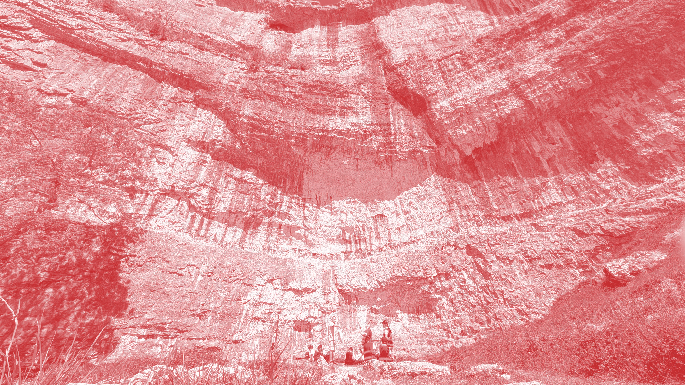

# Elmet Brae

## Malham Cove field recordings

### Orllewin

Birdsong and chatter from visitors reverberating off the cliff face at Malham Cove, recorded with Oaka Instruments Verdi microphones and a Zoom H1 XLR recorder. Track 2 was recorded close to the water at the foot of the cliff where House Martins were collecting mud for nests.

* [1 20250520 Malham Cove house martins and visitors](20250520_malham_cove_house_martins_1.mp3)
* [2 20250520 Malham Cove house martins mud site](20250520_malham_cove_house_martins_2.mp3)
