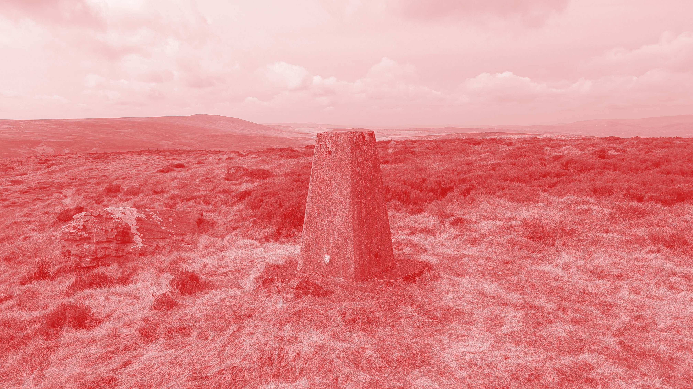

# Elmet Brae

## The Land Part 1

### Various

* [1 major sunrise (prologue) - takumar](1_takumar_-_major_sunrise_prologue.mp3)  
These drone pieces (see also track 14 in Part 2) are the first results of a little experiment in permacomputing-inspired software synthesis. I have written short (~100 LOC) programs in C which rely only on the standard library and simply write raw audio data to stdout. To listen, you can pipe them to tools like aplay or pacat on Linux or aucat on BSD, or you can redirect them to a file to save the output. The audio samples are generated on the fly using small lookup tables of sine values, so very little memory is used and these programs should run fine on quite old machines. The drones themselves are basically just a small number of sine waves, with their pitch or amplitude modulated by slow sinusoidal LFOs, so they variously harmonise with or beat against one another. I chose LFO frequencies which are relatively prime to one another so it takes a long time for the combination to loop - they do loop, but personally I can listen for an hour without getting bored, easily
* [2 feed - bad diode](2_bad_diode_-_feed.mp3)  
my track was created by live merging two different nature samples in an Octatrack and creating feedback and shimmering effects through several layers of live resampling. A heavily distorted electrical guitar and some vocal samples were added using the same process, playing with feedback and live modulation and everything was bathed in a dense fog of reverb
* [3 brume - metasyn](3_metasyn_-_brume.mp3)  
this recording was made entirely with analog synthesisers, and is almost entirely generative, with only a small few sections played live during recording. the generative part comes from multiple LFOs, noise generators, and overlapping polyrhythmic sequencers
* [4 zoom048 - exquisitecorp](4_exquisitecorp_-_zoom048.mp3)
* [5 kurakkusu - noisefuel](5_noisefuel_-_kurakkusu.mp3)  
this track is dedicated to all the little creatures that inhabit the cracks of the Earth and the energy that connects them
* [6 untitled (wind) - tom hackshaw](6_tom_hackshaw_-_untitled_wind.mp3)
* [7 a trot about - he can jog](7_he_can_jog_-_a_trot_about.mp3)
* [8 pomeriggio umido - nonmateria.com](8_nonmateria_-_pomeriggio_umido.mp3)  
Ambience was recorded in an evening in Villa delle Rose (Bologna). The field recording was filtered from the folderkit sampler used together with orca, track recorded in one take with jack_capture
* [9 earthy - ten digits](9_ten_digits_-_earthy.mp3)
* [10 river flowing - tttooooni](10_toni_-_river_flowing.mp3)  
Ambient + Field Recording track with sounds from around Ukraine. The walking on crunchy leaves was was recorded in Kyiv. The river, cricket sounds are from the Carpathian mountains, in Western Ukraine
* [11 morning - afk mario](11_afk_mario_-_morning.mp3)
* [12 mervī - wormsong](12_wormsong_-_mervi.mp3)
* [13 the wind cannot be changed, but we can adjust our sails - musicamatica](13_musicamatica_-_the_wind_cannot_be_changed_but_we_can_adjust_our_sails.mp3)  
Experimented with Beepbox, exported & processed it in Audacity. Browsed through videos at Openbeelden.nl & stumbled upon almost hundred year (1924) old sailing footage shot in The Netherlands. Combined it. The title is based on a Dutch saying. I had never heard it before, seems apt for current times though
* [14 fells - tehn](14_tehn_-_fells.mp3)  
half asleep melodies from forgotten tapes, familiar wind, unfamiliar birdfolk while visiting their volcano

Alternative downloads:

* [Download as FLAC on itch.io](https://orllewin.itch.io/elmet-brae-eb01-the-land)
* [Beldam Records Bandcamp Mirror](https://beldamrecords.bandcamp.com/album/elmet-brae-the-land)

Mastering by Bad Diode, Elmet Brae logo and The Land album artwork by Rostiger ([cover.jpg](cover.jpg)) - huge thanks to both.