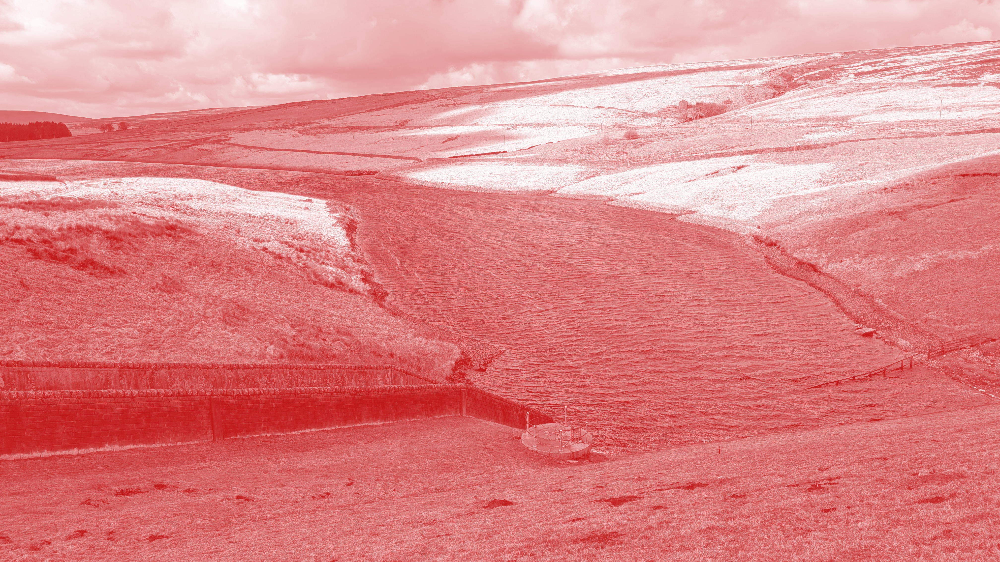

# Elmet Brae

## The Land Part 2

### Various

* [1 elemental - colin drake](1_colin_drake_-_elemental.mp3)
* [2 from below - zuggamasta](2_zuggamasta_-_from_below.mp3)  
When Orllewin created a call¹ for ambient and noise music from the Merveilles Community, I knew that I wanted to join. Very excited, I started experimenting with noise, recordings and feedback again. Remembering that I had multiple iPhone field recordings from 2018 to 2022 that had not been unearthed before, things got interesting. The one recording that struck me the most was from 2021, an innocent recording of rain dripping through our flat’s balcony. If only I knew back then that this serious amount of rain days after a long drought would push from below the ground into our own basement. Would capture my partner in a 4 hour traffic jam. Erode the landscape so much that a whole neighborhood would be rendered uninhabitable and cost people their lives
* [3 paying the piper - caffeine's heir](3_caffeines_heir_-_paying_the_piper.mp3)  
I used digital field records from a stroll into the woods near Portland, Oregon, as the basis, recorded in tape, and then used a script to jump around multiple points of them. From there, I added layers using my trusty MIDI keyboard and organic synths to create an earthy and comfy interlude
* [4 bog sacrifice for all oil execs - ritual dust](4_ritual_dust_-_bog_sacrifice_for_all_oil_execs.mp3)  
Climate rage and field recordings taken in the Carrickynaghtan Bog were the main ingredients used in the crafting of this track. They were then fused and charged through feedback loops, layers of distorted drums and the alchemical transformation process of the Strega
* [5 the shern's question - aliceffekt](5_aliceffekt_-_the_sherns_question.mp3)
* [6 twilight in the mushroom forest - patchlore](6_patchlore_-_twilight_in_the_mushroom_forest.mp3)  
The forest heard in this track was entirely synthesized. First, each sound component in the forest was rendered individually as stems. Then, the stems were mixed together and processed with a forest impulse response via convolution. The musical ambience was sampled from "Day 20" in my Sound Mantra series for Looptober 2023, processed through the PaulStretch algorithm
* [7 artemisia grove - paloma kop](7_paloma_kop_-_artemisia_grove.mp3)
* [8 night - afk mario](8_afk_mario_-_night.mp3)
* [9 memory leak - slash](9_slash_-_memory_leak.mp3)  
Recording notes: Main instruments: K1m + M303. Sequencer: Tidal Cycles + SuperDirt Voltage
* [10 bats - james chip](10_james_chip_-_bats.mp3)
* [11 mousse et aquilon - garvalf](11_garvalf_-_mousse_et_aquilon.mp3)  
Made from an Orca loop, Zynaddsubfx synths, processed with Audacity and Ardour
* [12 kalama kon - lectronice](12_lectronice_-_kalama_kon.mp3)  
An image of windy trees came to my mind. Then this track simply happened. It flowed effortlessly out of a few knob twists, as if it has always been here, waiting to be released. I expected the Land to be harder to reach, but it came to me instead. ("kalama kon" means something like "sound of breath/spirit" in Toki Pona)
* [13  storm of unmagic - calris](13_calris_-_storm_of_unmagic.mp3)
* [14 major sunrise - takumar](14_takumar_-_major_sunrise.mp3)  
See info for track 1 in part 1

Alternative downloads:

* [Download as FLAC on itch.io](https://orllewin.itch.io/elmet-brae-eb01-the-land)
* [Beldam Records Bandcamp Mirror](https://beldamrecords.bandcamp.com/album/elmet-brae-the-land)

Mastering by Bad Diode, Elmet Brae logo and The Land album artwork by Rostiger ([cover.jpg](cover.jpg)) - huge thanks to both.
