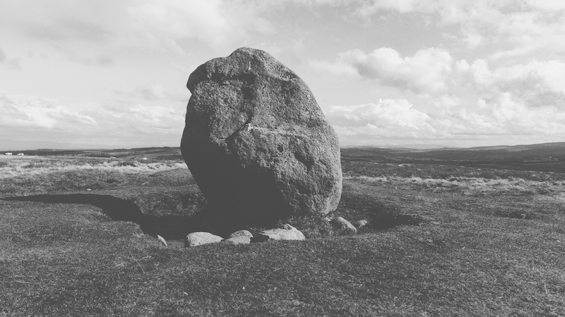
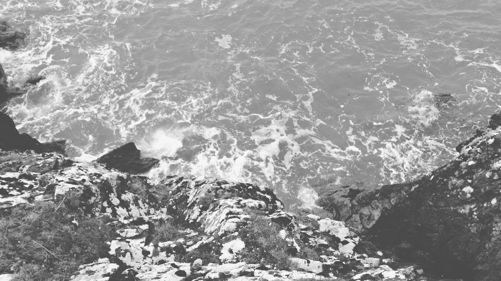

# orllewin.uk

## About

A human, born CO₂ at 333.73 ppm, living in Todmorden, Yorkshire, UK.

  

* [orllewin.uk](https://orllewin.uk) - this site
* [pudseyclough.uk](https://pudseyclough.uk) - a radio station
* [elmetbrae.uk](https://elmetbrae.uk) - a micro music label

## Contact

* [fediverse: @oppen@merveilles.town](https://merveilles.town/@oppen)
* [email: orllewin@fastmail.uk](mailto:orllewin@fastmail.uk)

---

## Recent projects

* [Resonance](projects/resonance/) - a drone instrument and sequencer for Playdate
* [Modular Play](projects/modular_play/) - a fully modular audio playground for Playdate

## Internal links

* [Stones](stones/) - a list of visited stones, mostly neolithic
* [Trigpoints](trigpoints/) - trigpoint bagging
* [Algorithms](algorithms/) - common code

## Archive

* [unkempt digital garden](digitalgarden/)

---

  

All code used to create this website can be found at [github.com/orllewin/web](https://github.com/orllewin/web). The digital garden archive was generated previously from an Obsidian vault.

