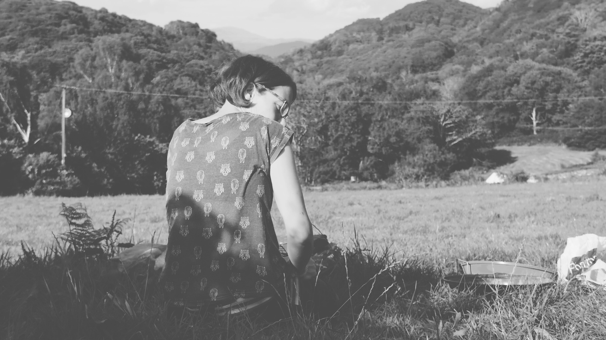
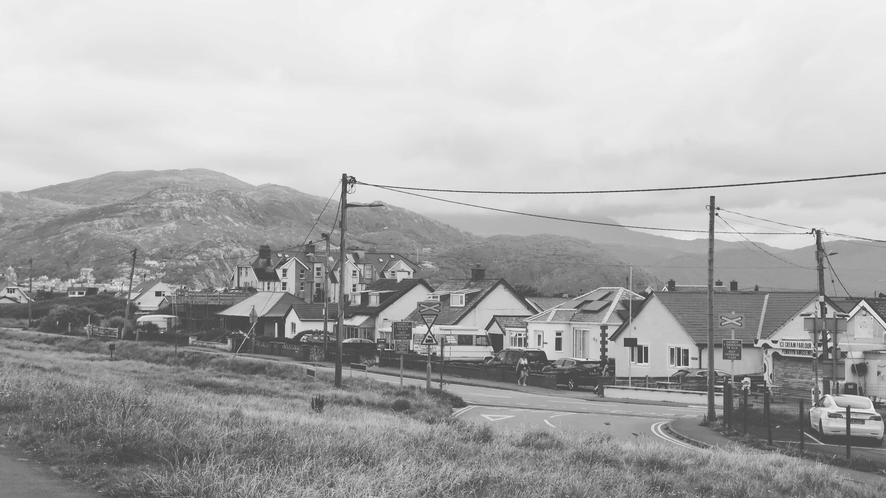

# Lento

Lento was a fairly ambitious project that was designed for use with Moment's Anamorphic phone lens. It could automatically 'desqueeze' photos taken with the lens to the correct aspect ratio and also apply look-up-tables/LUTS. Interest with anamorphic lenses waned and the LUT feature became the main focus. Although development has paused on the project I still use it almost daily.

* [orllewin_lento_1_1_0.apk](orllewin_lento_1_1_0.apk) - download (4.2MB)
* [github.com/orllewin/lento](https://github.com/orllewin/lento) - archived

An aborted start was made on a Lento 2: [github.com/orllewin/lento2](https://github.com/orllewin/lento2) which I think was superceded by a Lento 3 but I can't find the repository.

