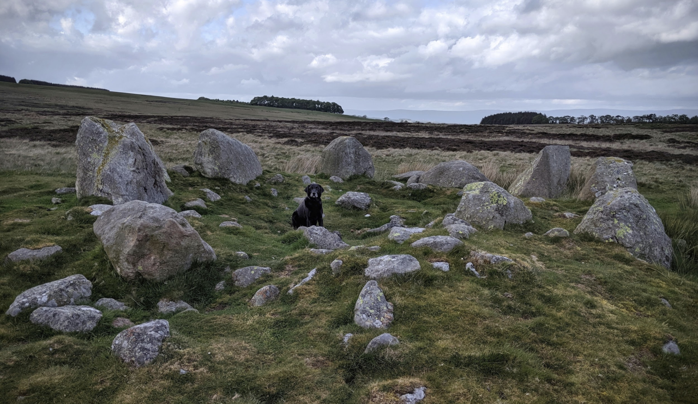
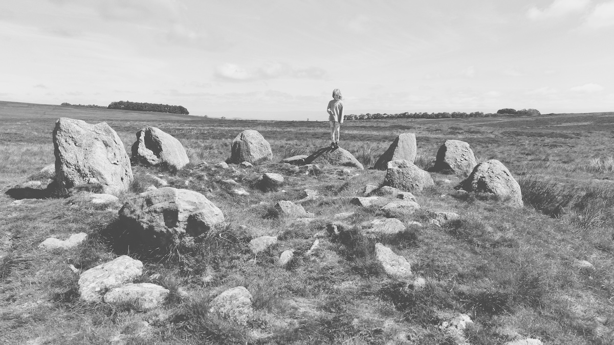

# Cairn Circle

## Askham Fell, Cumbria

Originally posted: 26th May 2019


<small>Dog, W, for scale</small>

[OS Grid Ref: SD 94827 22566](https://osmaps.ordnancesurvey.co.uk/54.59103,-2.78437,18/pin)

```

Geo URI: geo:54.5910,2.78437
Latitude: 53° 41' 58" N
Longitude: 2° 4' 47" W
    
```

Up on Moor Divock/Askham Fell along with the Cop Stone, the Cockpit Circle and others. 


<small>A for scale, 2nd June 2024</small>