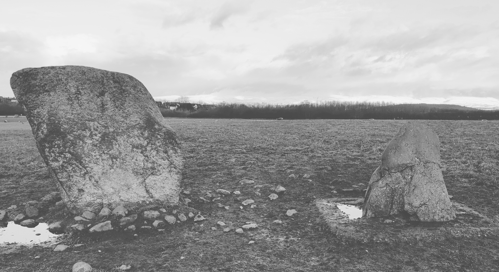
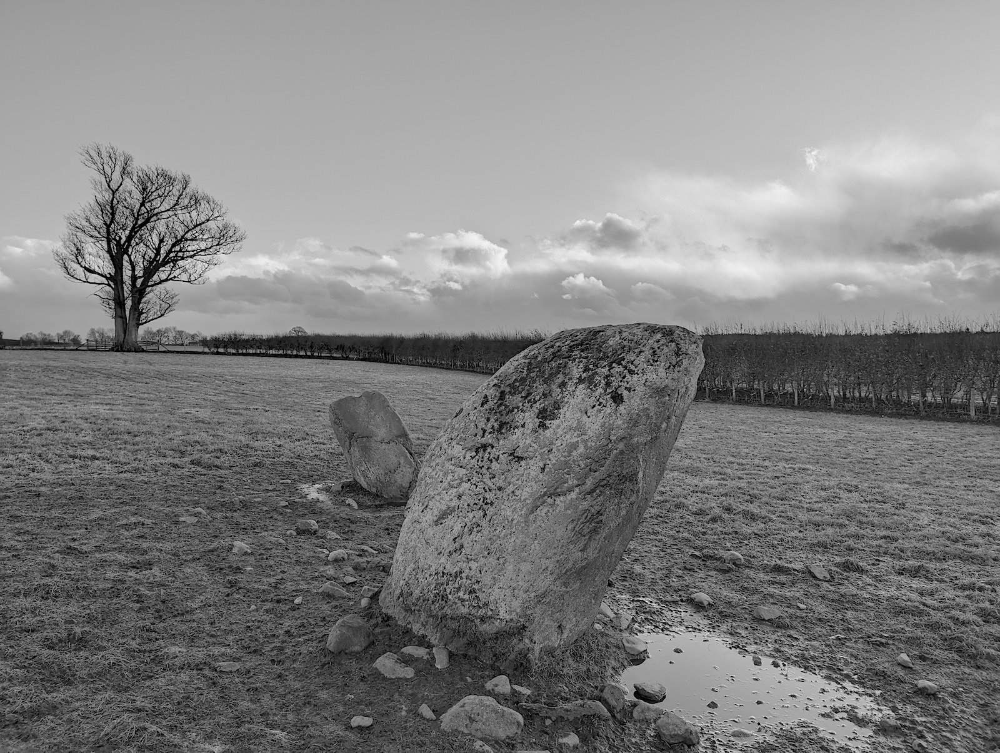

# Clifton Stones

## Clifton, Cumbria

Starting at Clifton, walk past Clifton Hall, along the path that runs along the motorway and through a couple of soggy fields.

Geo URI: geo:54.6263,2.7274  
Latitude: 54° 37' 35" N  
Longitude: 2° 43' 39" W  

