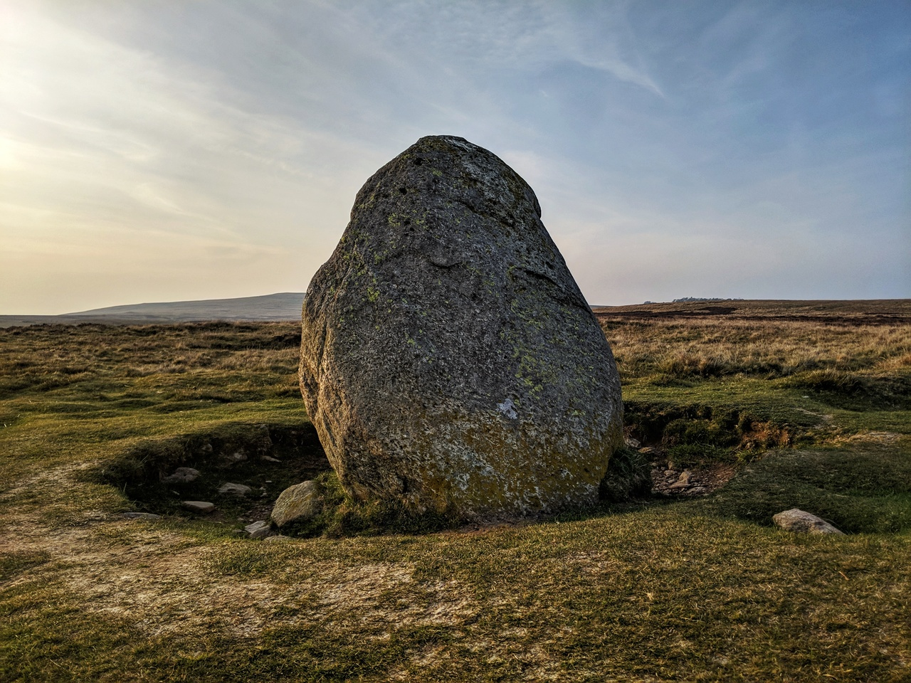
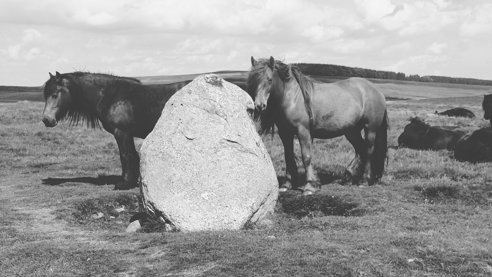

# Cop Stone

## Askham Fell/Moor Divock, Cumbria

Geo URI: geo:54.5873,-2.7820  
Latitude: 54° 35' 14" N  
Longitude: 2° 46' 55" W  

A glacial erratic (or is it?). Our dog Molly has her ashes scattered here (generally frowned-upon in the lakes but my wife grew up on this fell so we claim locals-rights!)

