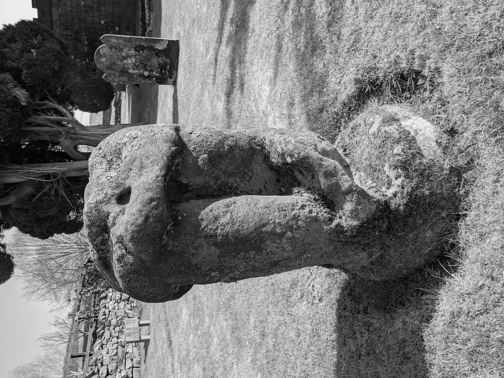
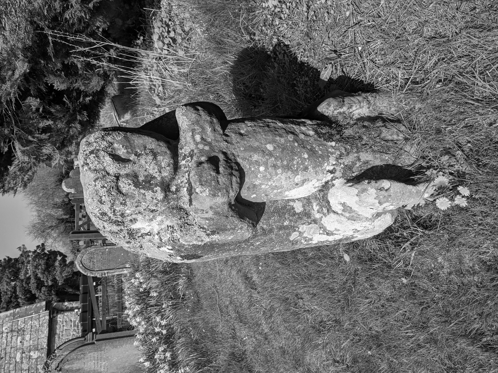
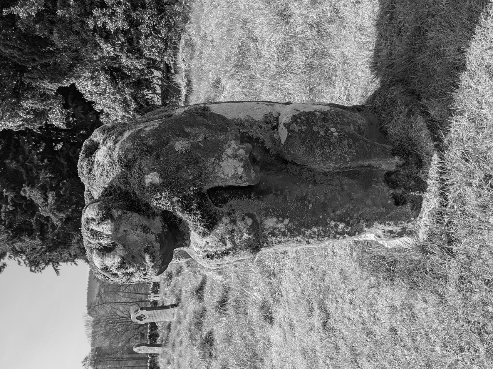
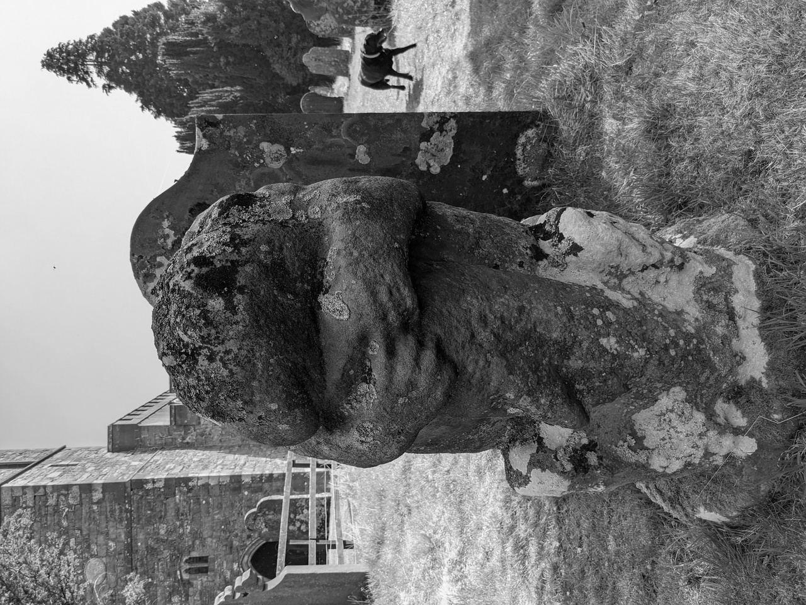

# Dacre Bears

## Dacre, Cumbria

The Dacre Bears are four stone 'bears' in the churchyard at St. Andrew's Church, Dacre. Nobody knows when they're from but they pre-date Dacre itself which was first mentioned by Bede in AD731. They're probably not actually bears, I think that name comes from the fourth creature below which does resemble one from a cetain angle.

 
 
 