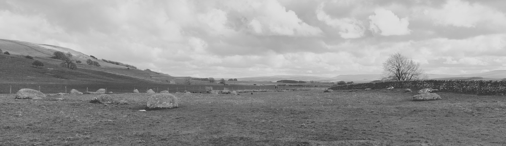
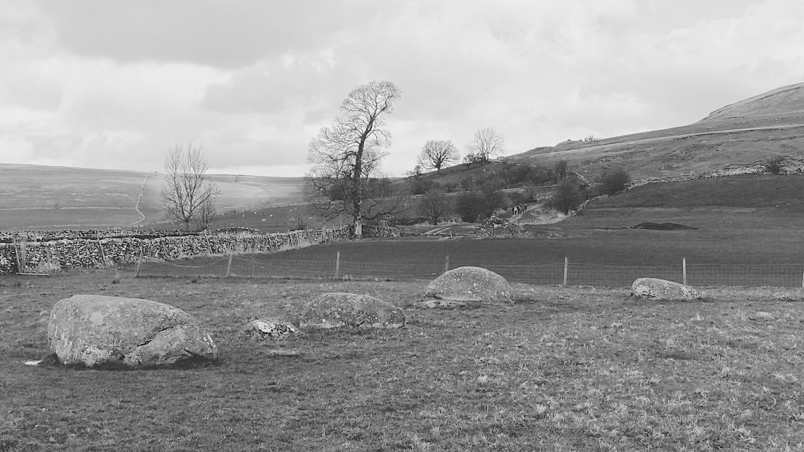
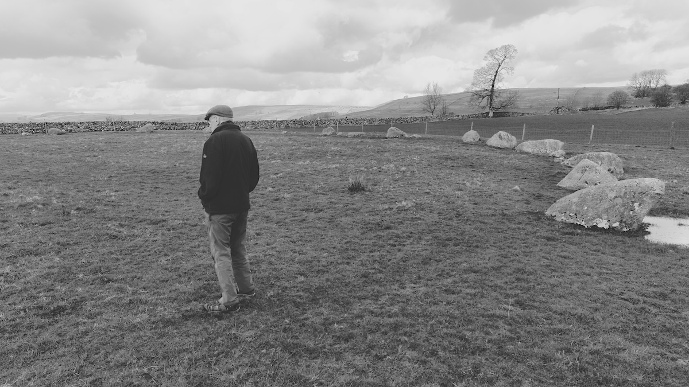
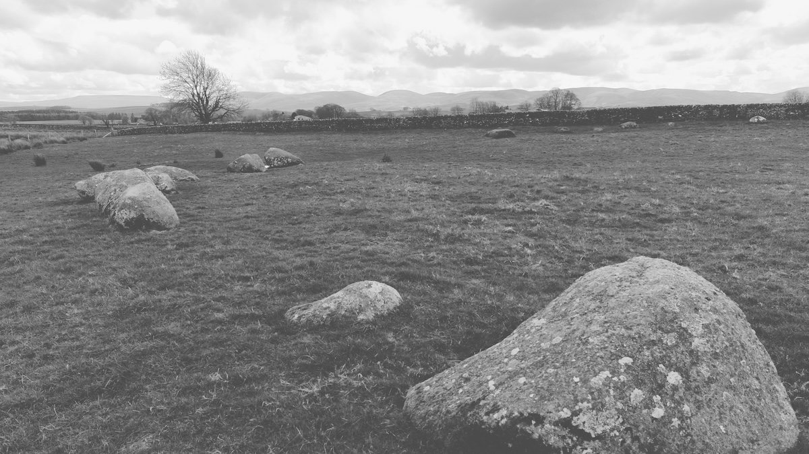

# Gamelands Stone Circle

Visited: 30th March 2024

Also known as Orton Stone Circle.

OS Grid Ref: NY 64010 08170  
Latitude: 54°28'3" N  
Longitude: 2°33'24" W  

## Links
* [megalithic.co.uk](https://www.megalithic.co.uk/article.php?sid=927)
* [stone-circles.org.uk](http://www.stone-circles.org.uk/stone/gamelands.htm)
* [visitcumbria.com](https://www.visitcumbria.com/evnp/gamelands-stone-circle/)
