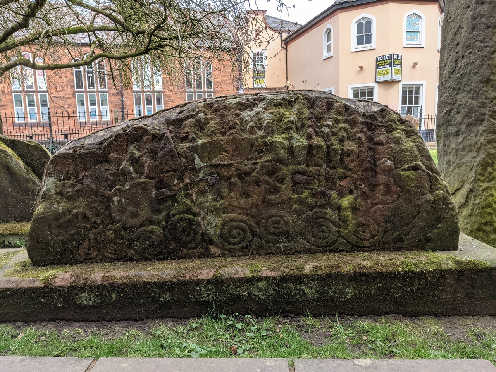
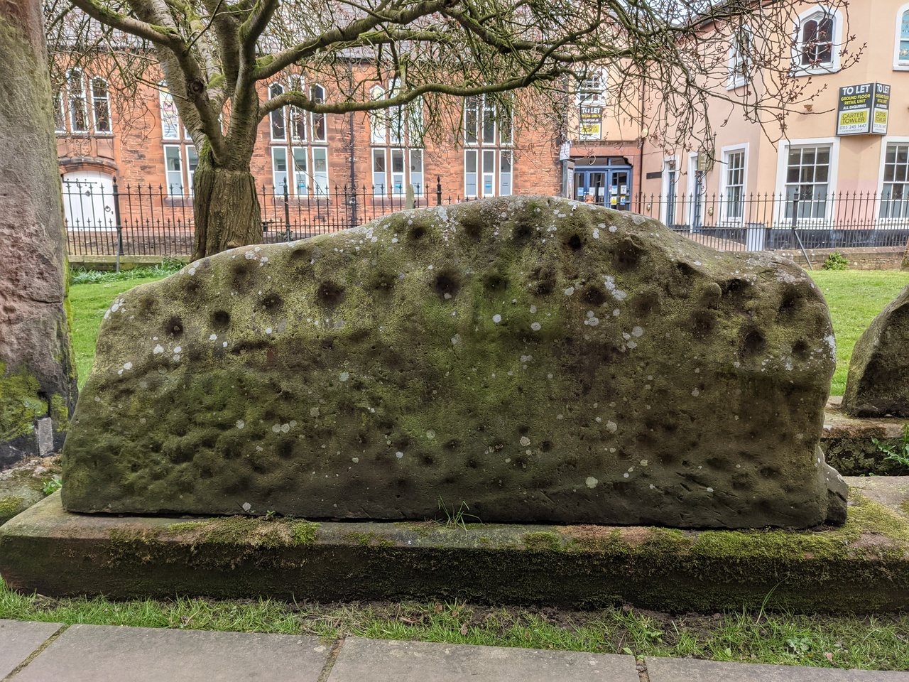
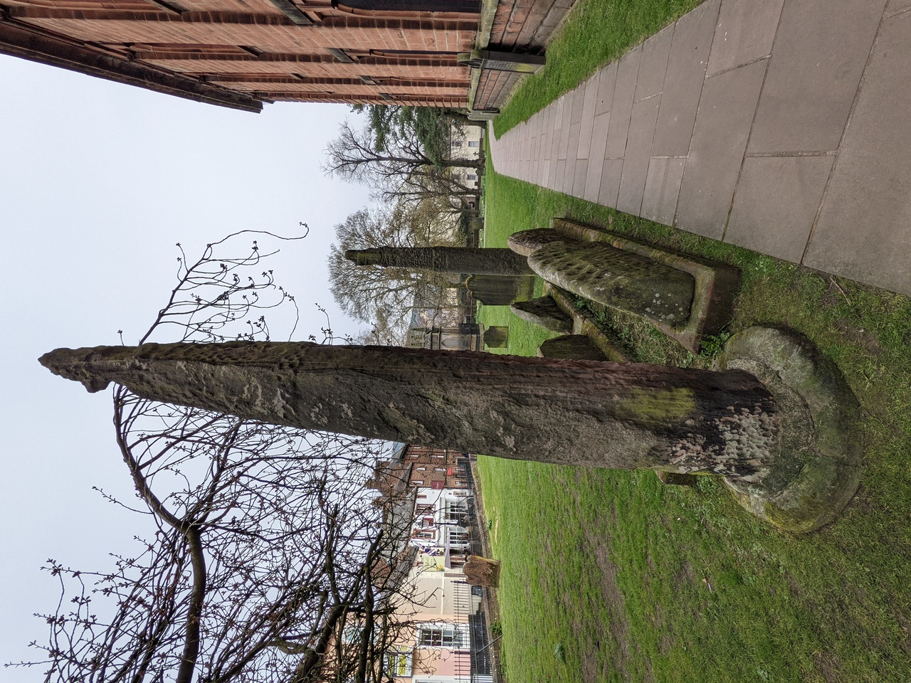
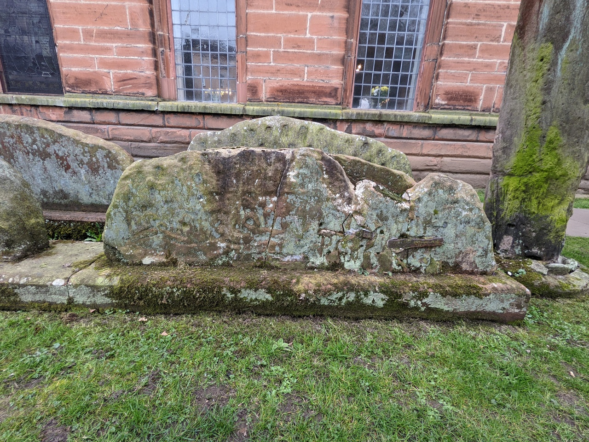
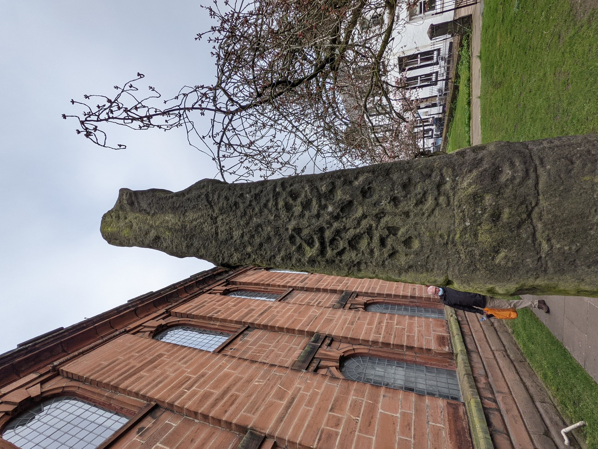
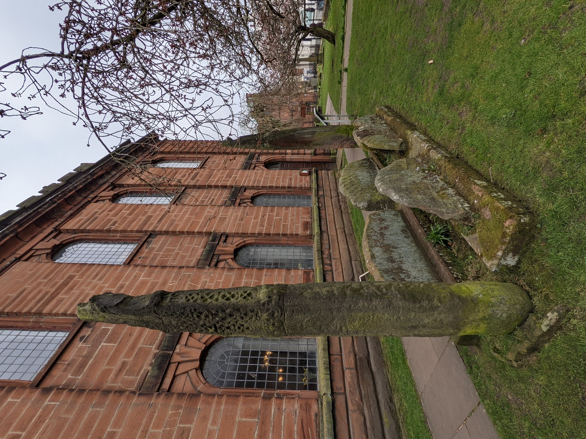
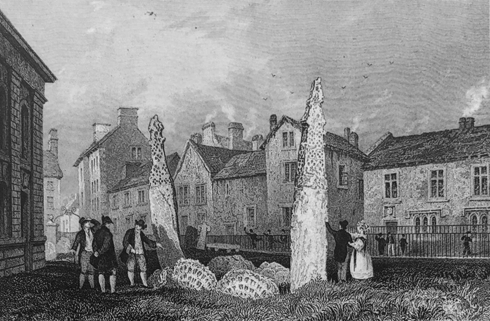
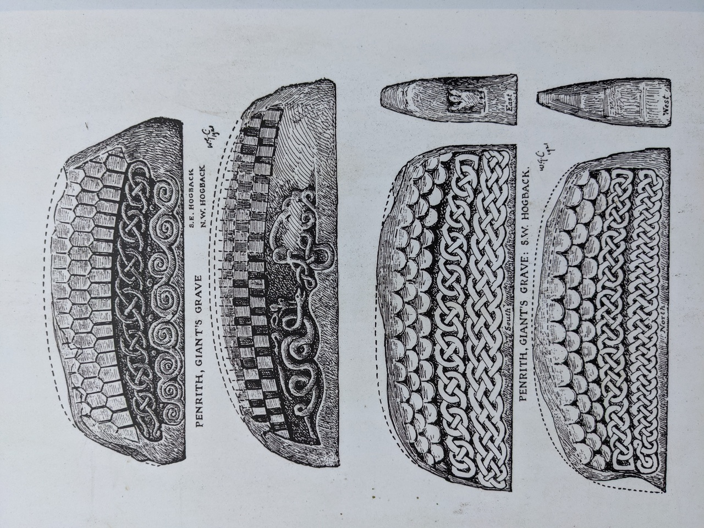

# Giants Grave

## The Giant's Grave, Penrith, Cumbria

Geo URI: geo:54.6642,-2.7515  
Latitude: 54° 39' 51.1" N  
Longitude: 2° 45' 05.4" W  

Located in the churchyard of St Andrews Church in the centre of Penrith. Local legend calls it the grave of Owen Caesarius, King of Cumbria from 920 to 937.

Illustrations from the information board:

Visited 20210418