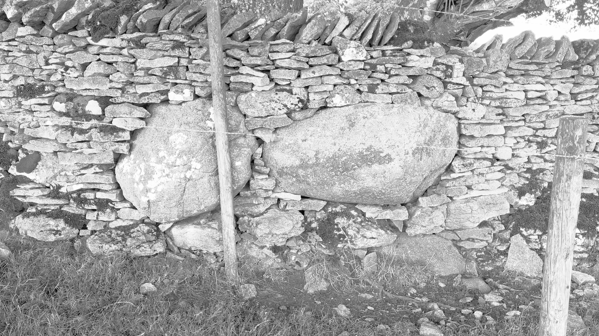

# Kalmott Cairn Circle

## Oddendale, Cumbria

Date: 25th August 2022

Found while visiting the main [Oddendale](oddendale.md) circle by the path next to the farm stone wall, a beautiful little circle with three stones in the centre.

[Kalmott cairn circle](https://www.megalithic.co.uk/article.php?sid=23859)

The wall adjacent incorporated two large stones:

