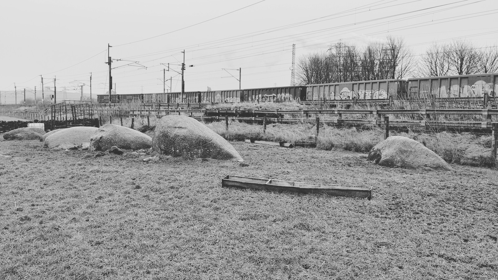

# Kemp Howe

Visited 28th December 2022

Finally made it to Kemp Howe (Shap, Cumbria) after ten years of driving right past it (always on the way to or from the in-laws, in later years with tired children). Was once a very impressive stone circle, unfortunately the Victorians' felt a new railway line was more important.

