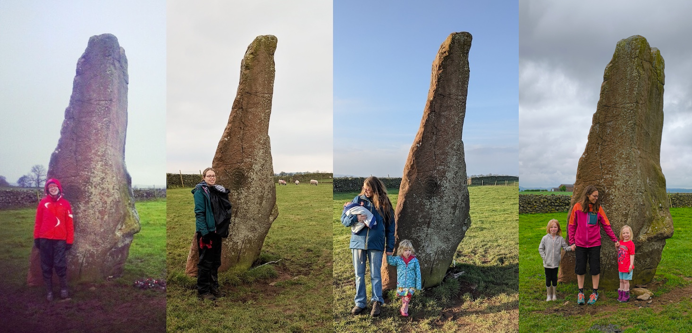
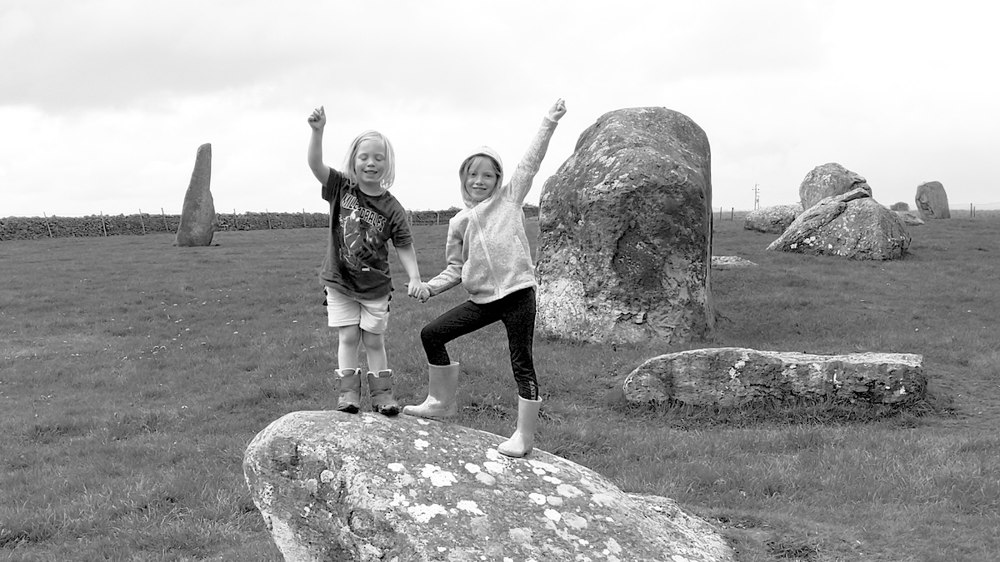
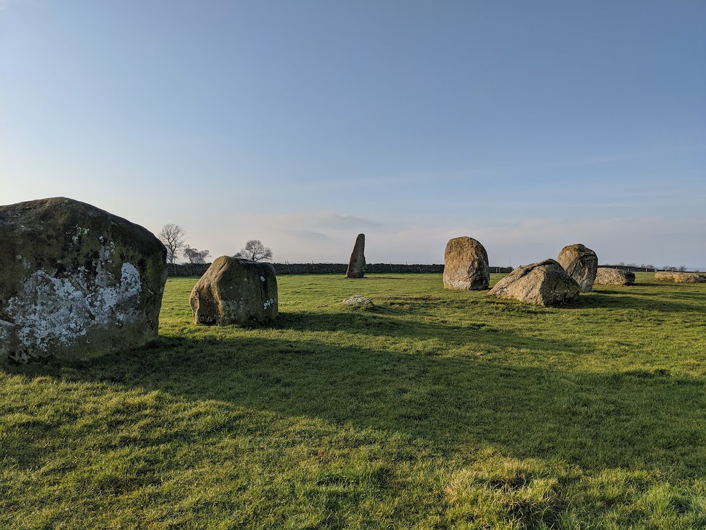
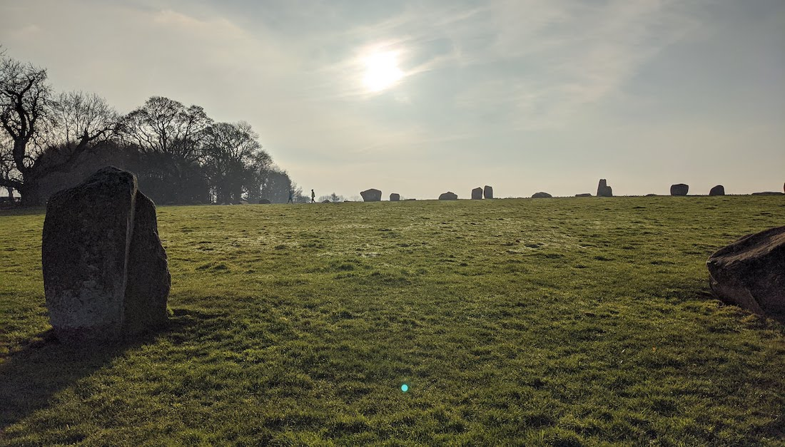
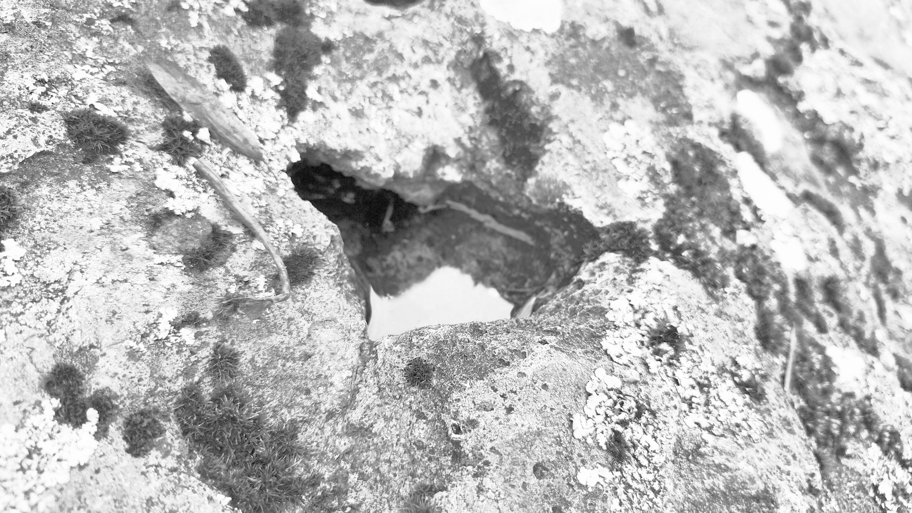

# Long Meg

## Long Meg & Her Daughters Stone Circle, Cumbria

Geo URI: geo:54.7276,-2.6671  
Latitude: 54° 43' 39" N  
Longitude: 2° 40' 1" W  

Long Meg & Her Daughters Stone Circle, a wider photo showing some of the huge circle

P called these little pools of water on top of the stones 'spider puddles'
