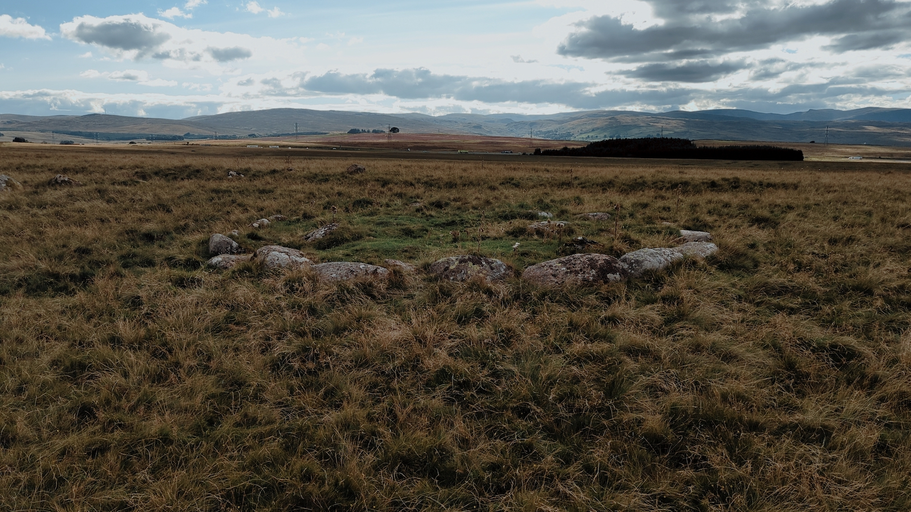
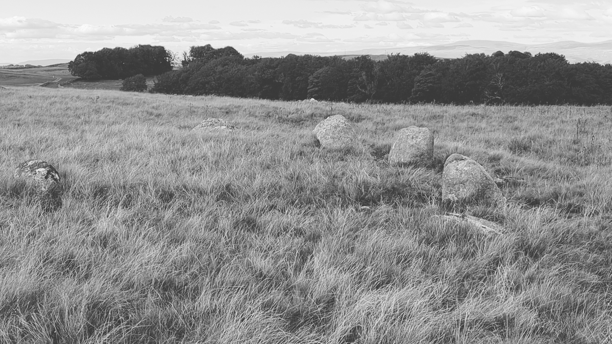

# Oddendale

## Oddendale, Cumbria

Visited: 25th August 2022

This is just off the M6 turn off for Shap that we do at least every month when visiting the in-laws. Travelling either way we're always too tired for a stop so haven't visited in all the years we've been passing. I finally did it as a solo trip from the in-laws house in Helton, through some backroads in Shap and across the fell on a single-track road, parked up by a farm at a suitable place and walked across the easy country to the circle. Like the Cock Pit on Moor Divock it's not easy to photograph, the stones themselves aren't big but the circle's is large. The inner circle is more pronounced and precise and there's a good atmosphere despite the constant sound from the motorway. See also [Kalmott Cairn Circle](Kalmott%20Cairn%20Circle.md).

Inner circle:

Geo URI: geo:54.5098,-2.6316  
Latitude: 54° 30' 35" N  
Longitude: 2° 37' 54" W     

