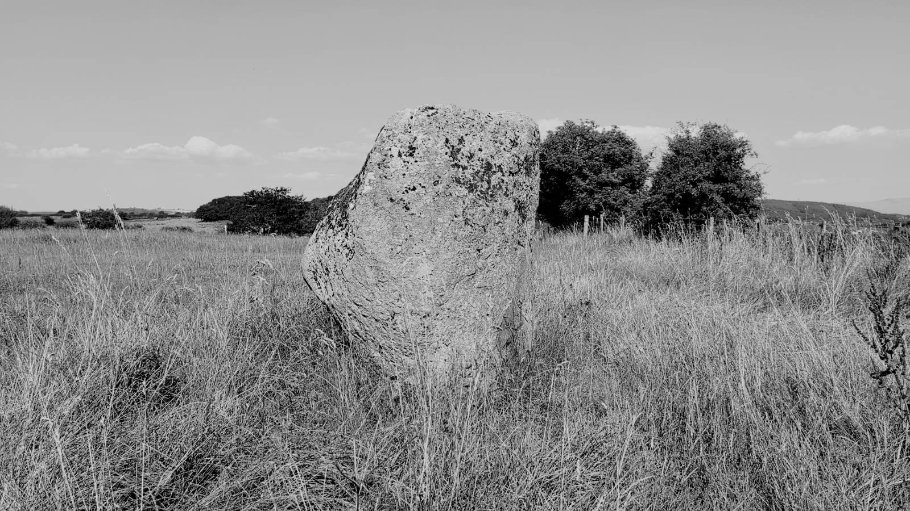
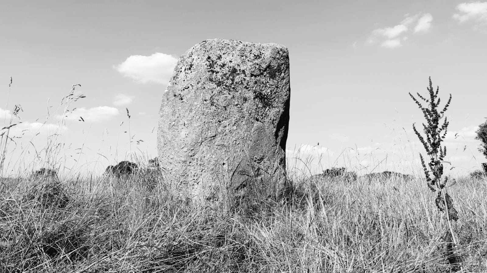
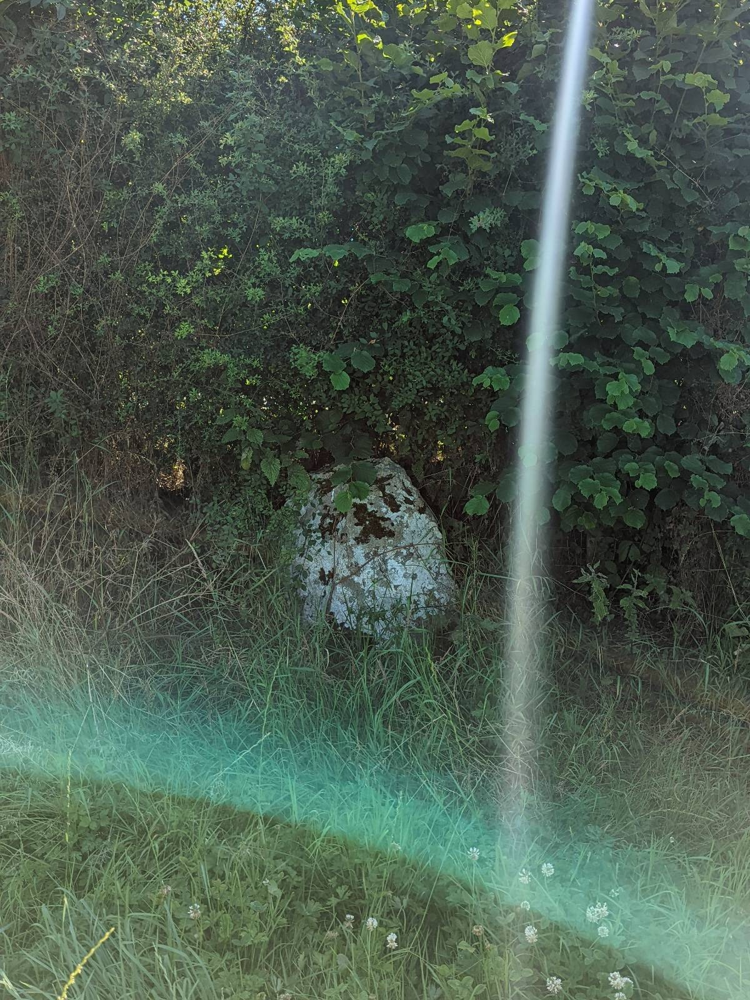
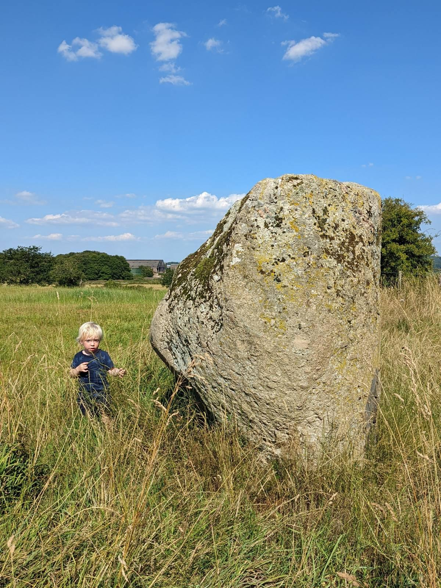

# Sewborwens

## Sewborrans/Sewborwens Near Greystoke, Cumbria

Geo URI: geo:54.5873,-2.7820  
Latitude: 54° 39' 45" N  
Longitude: 2° 47' 40" W  

There's a second stone (and a third I didn't spot) in the hedgerow by the road. Photo with P for scale:

* [stone-circles.org.uk/stone/sewborrans.htm](http://www.stone-circles.org.uk/stone/sewborrans.htm)
* [megalithic.co.uk](https://www.megalithic.co.uk/article.php?sid=10212)

Posted 20220812
