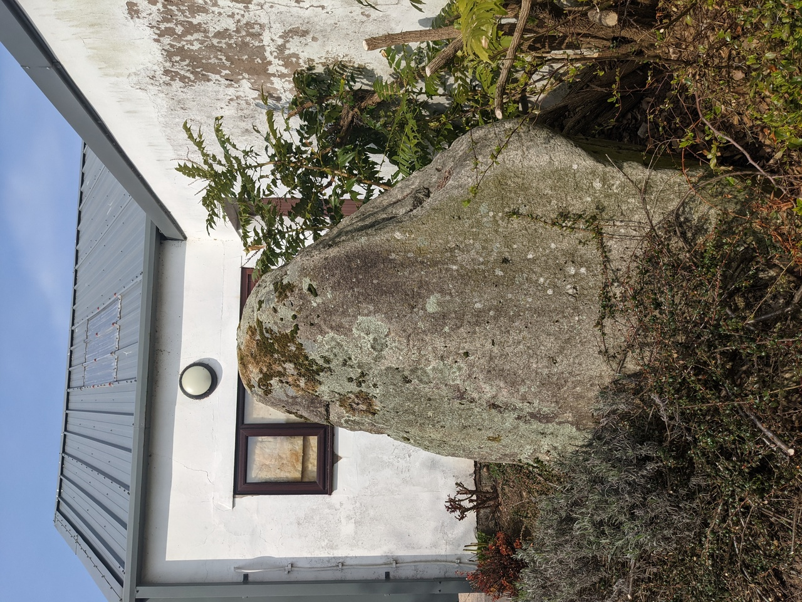
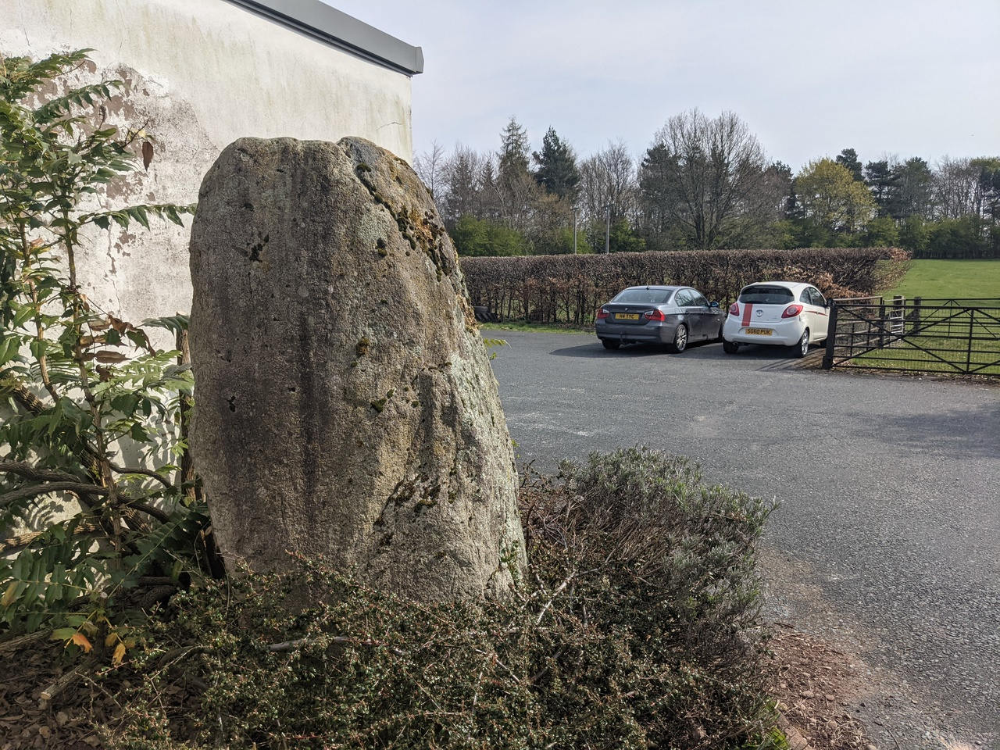
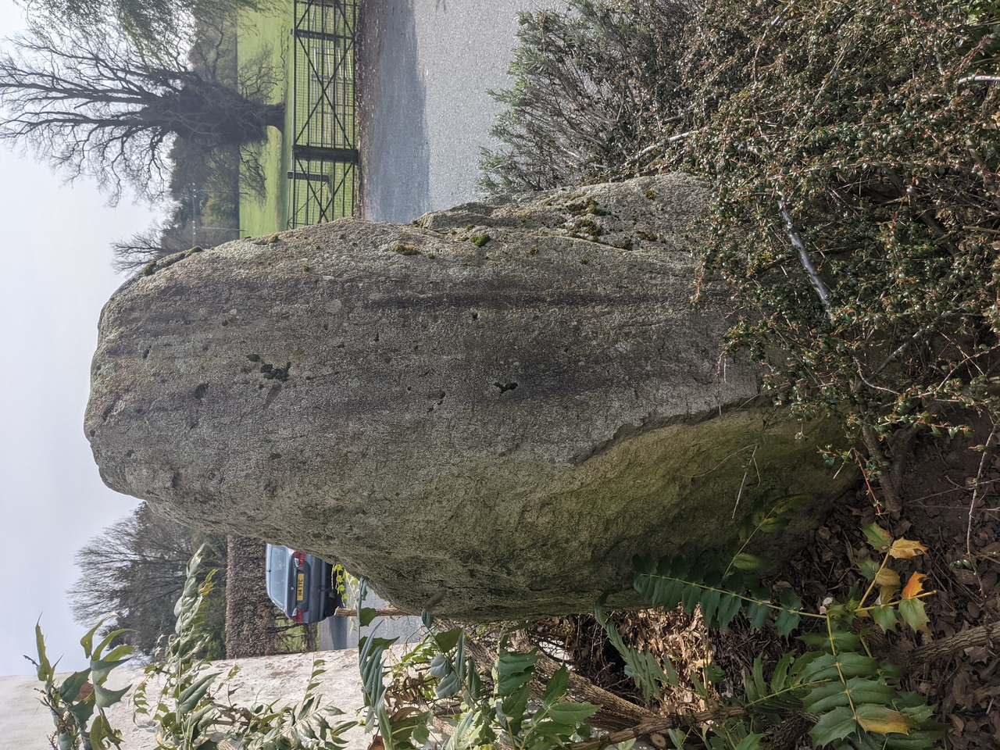
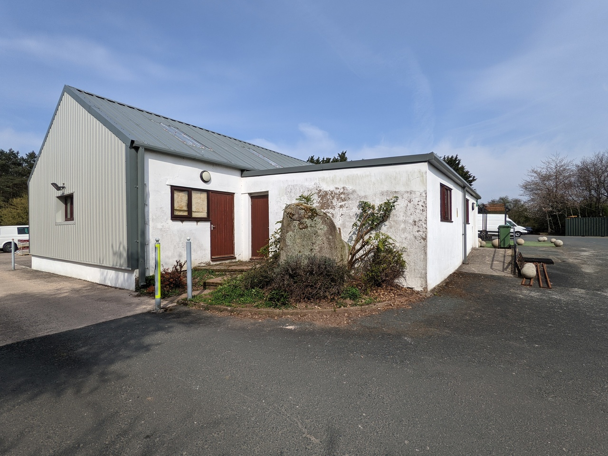
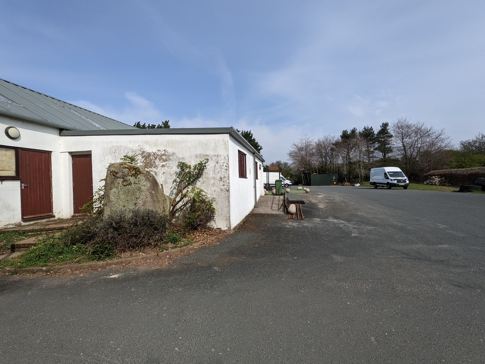

# Skirsgill

## Penrith, Cumbria

Geo URI: geo:54.6516, -2.7614  
Latitude: 54° 39' 05.9" N  
Longitude: 2° 45' 41.3" W  

A lone standing stone hidden in the corner of the Skirsgill industrial estate just off the A66/M6 roundabout by Penrith. Not in beautiful countryside but a minor miracle it wasn't removed during development.

Posted 20210420
