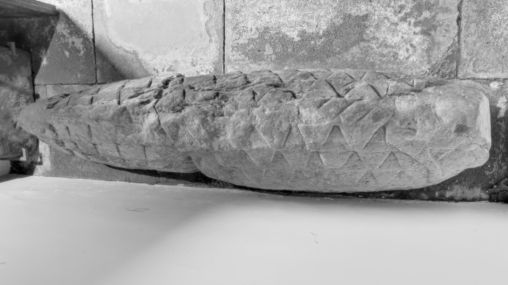

# St Michael’s Church, Addingham

Visited: 4th May 2024

Anglo-Saxon cross in the church yard.

A beautiful 'hogback' stone in the porch of St Michael's Church, Addingham, near Glassonby. The porch also holds some early Christian stones. 

## Links
* [megalithic.co.uk](https://www.megalithic.co.uk/article.php?sid=11073)