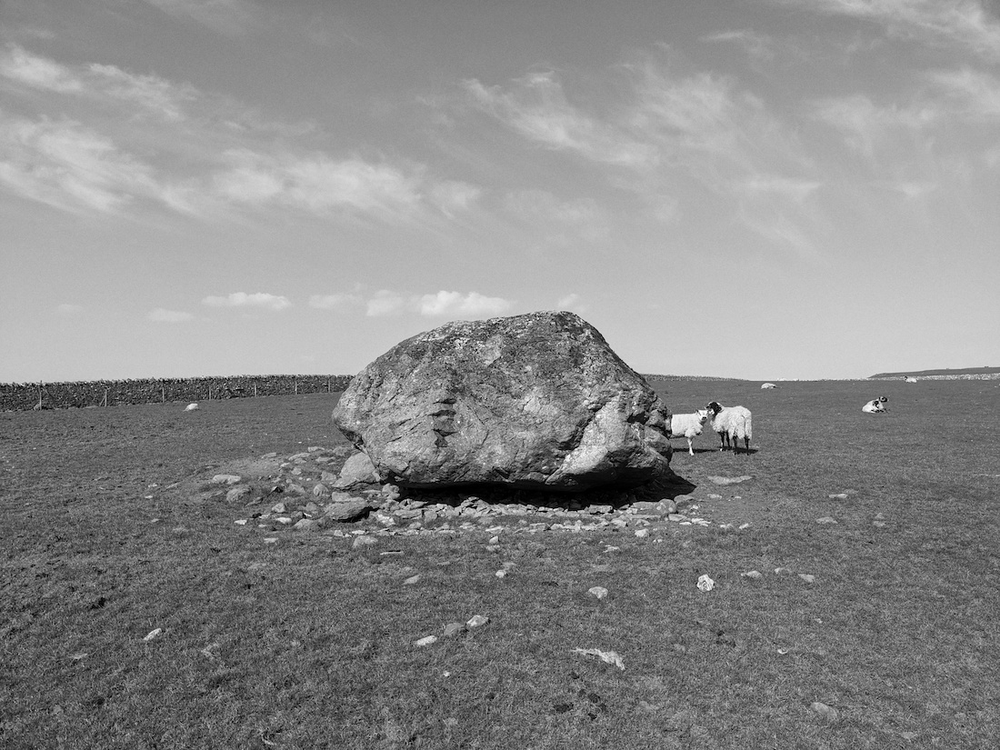

# Thunder Stone

## Shap, Cumbria

A 'glacial erratic', a natural stone that's been given a name over the centuries. Part of the Shap Avenue of stones and close to the [Goggleby Stone](https://maenhir.neocities.org/cumbria/gogglebystone)

Geo URI: geo:54.5350,-2.6922  
Latitude: 54° 32' 6" N  
Longitude: 2° 41' 32" W  

Visited 20210417