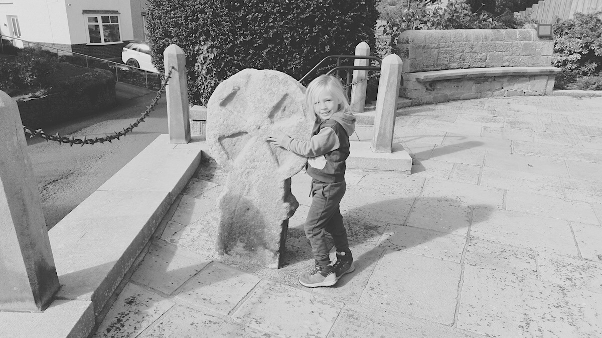
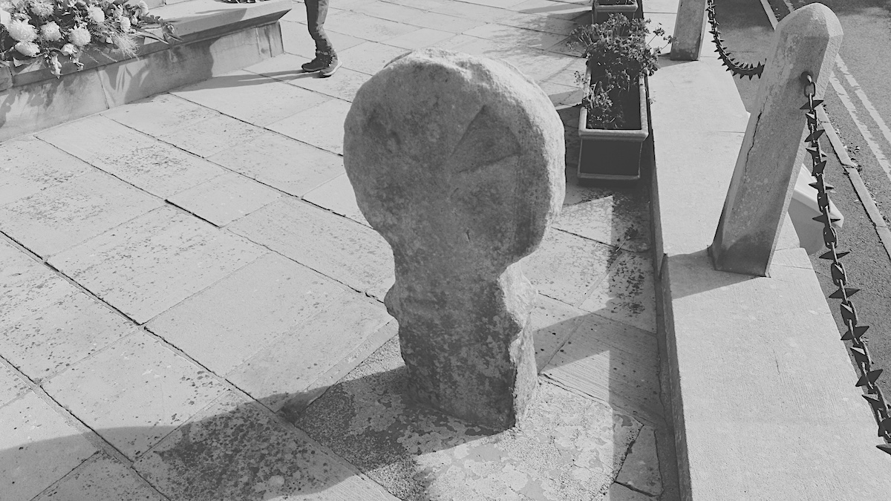
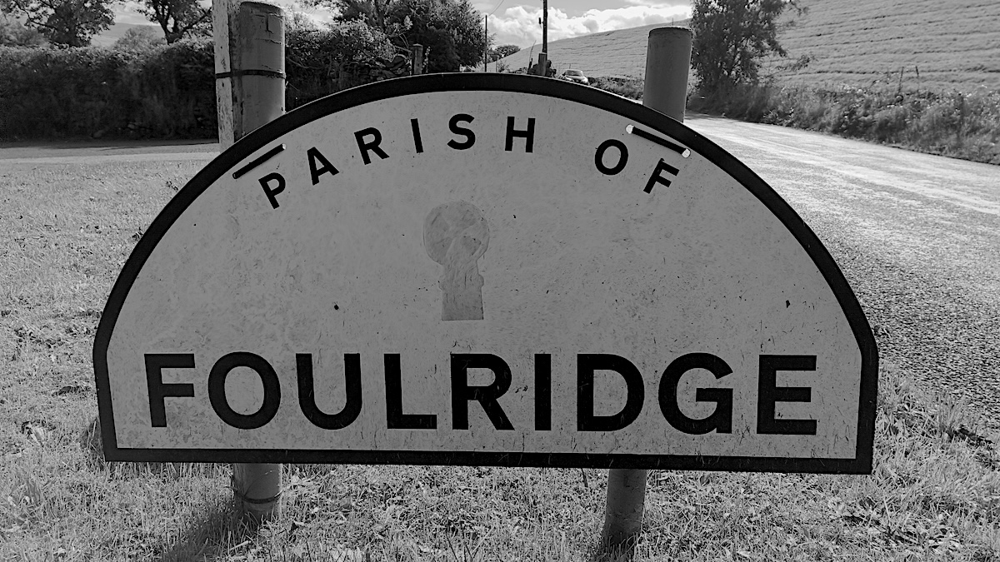

# Tallers Cross

[Foulridge](https://en.wikipedia.org/wiki/Foulridge), Burnley

Visited: 28th September 2024

Also known as Tailor's Cross, Salters Cross, Maiden's Cross. The location below is accurate, various other sources have the old location before the cross was moved next to the Foulridge war memorial, we discovered this after searching in vain before asking some friendly locals.

OS Grid Ref: SD 89021 42119  
Latitude: 53°52'31"N  
Longitude: 2°10'6"W  

## Links
* [Megalithic Portal](https://www.megalithic.co.uk/article.php?sid=26243)