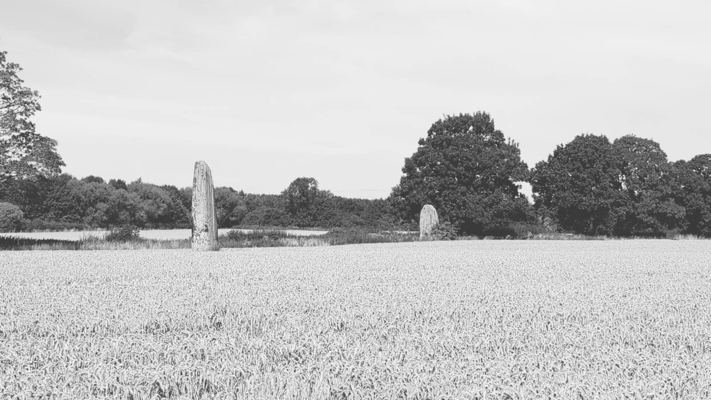
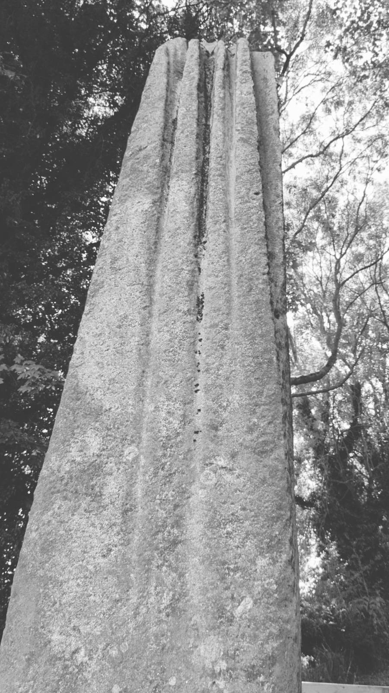
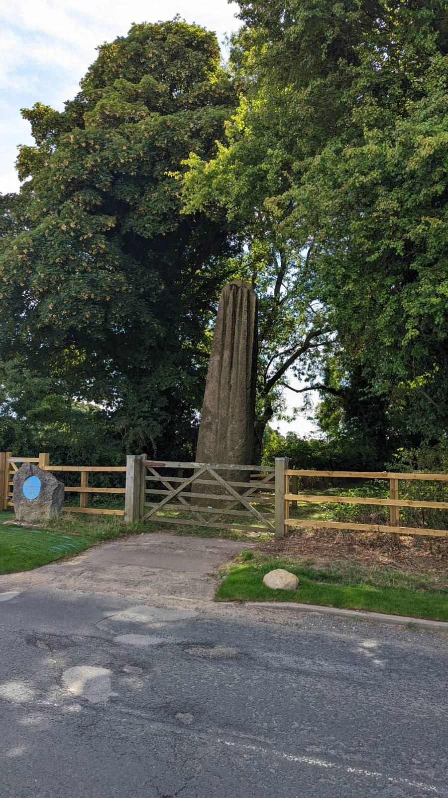

# Devils Arrows

[The Devil's Arrows](https://en.wikipedia.org/wiki/Devil%27s_Arrows), Boroughbridge, North Yorkshire.

Three very tall standing stones, two are on private farmland, a third is accessible to the side of Roecliffe Lane.

Visitied 20220809

