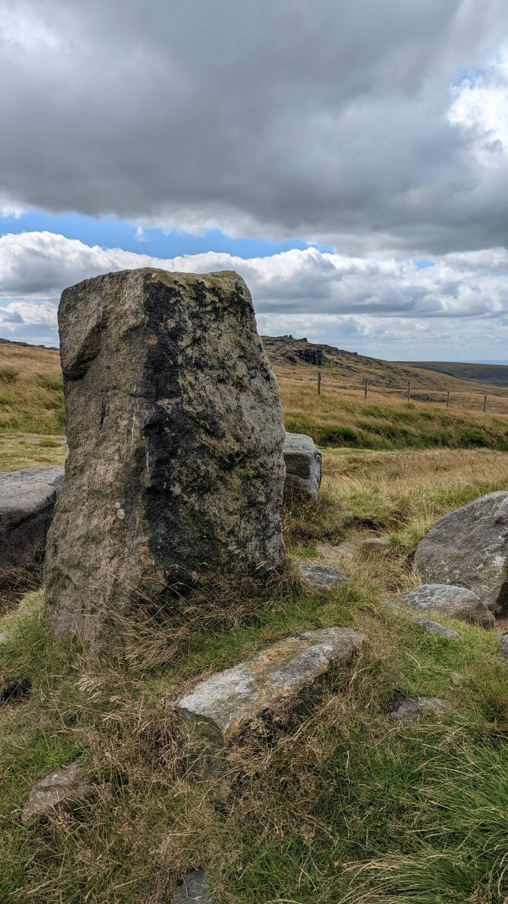

# Aiggin Stone

Close to Blackstone Edge by the side of an old Roman road.

Visited 20220803

* [Aiggin Stone, Blackstone Edge, Lancashire/West Yorkshire](https://thejournalofantiquities.com/2013/05/06/aiggin-stone-blackstone-edge-lancashirewest-yorkshire/)
* [Aiggin Stone - Marker Stone](https://www.megalithic.co.uk/article.php?sid=46513)