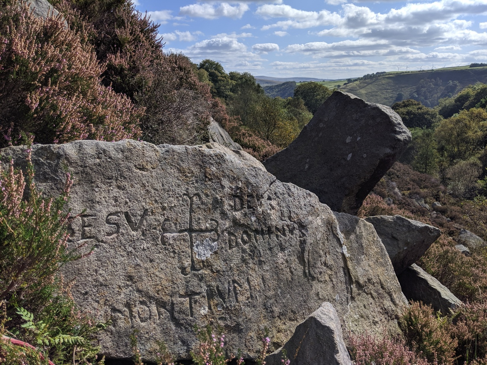
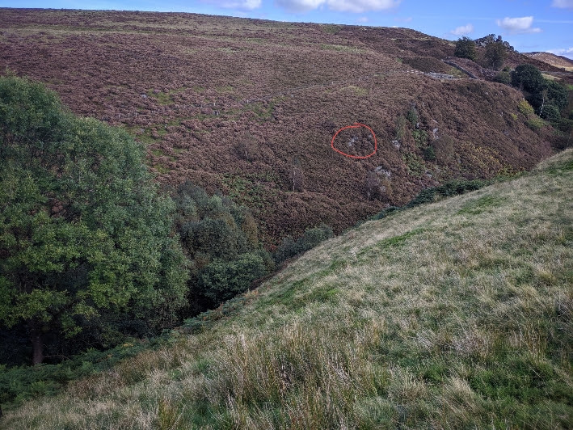
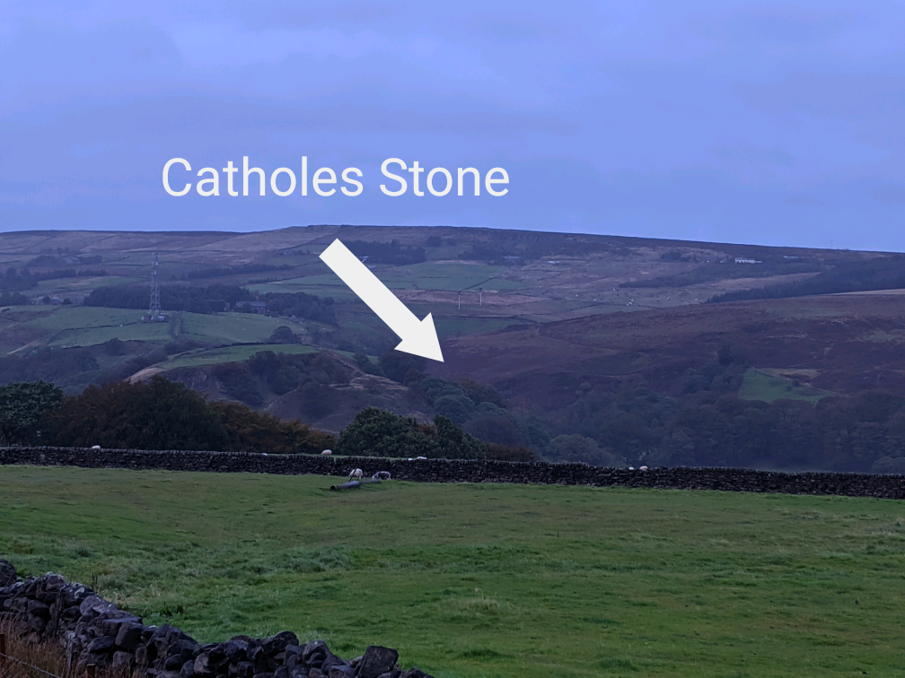

# Catholes Stone

## Todmorden, West Yorkshire

Geo URI: geo:53.7327, -2.1229  
Latitude: 53° 43' 57" N  
Longitude: 2° 07' 22" W  

I heard about the Catholes Stone from [Chris Goddard's book 'The West Yorkshire Moors'](https://christophergoddard.net/product/west-yorkshire-moors/). Lost for years then rediscovered in 1953 by pupils from nearby Robinwood School, it's in a fairly difficult to reach location with no footpaths and heather growing over a meter high.

The inscription reads IESU DEUS DOMINUS MONTIUM: Jesus, God, Lord of the Mountains.

I approached from the west side of the clough, climbing down to the brook, jumped across then found my way up through the heather. To the south I spotted larger groups of rocks so headed that way to inspect, the Catholes Stone was amongst the first I came across (the coordinates above were taken on the spot and are precise, if you use them finding it should be relatively straightforward).

View from the west looking back to Clunters, with the Catholes Stone highlighted:

View from across the valley at Todmorden Moor:

Posted: 20190917