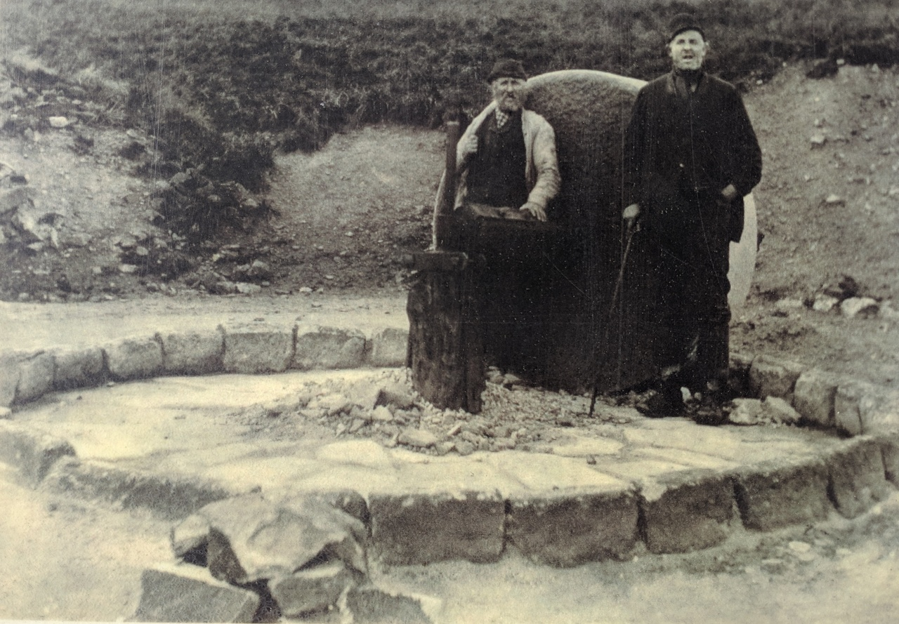
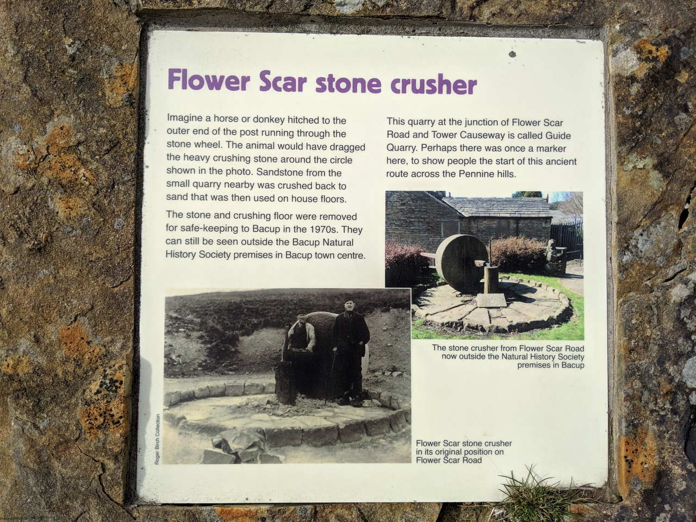
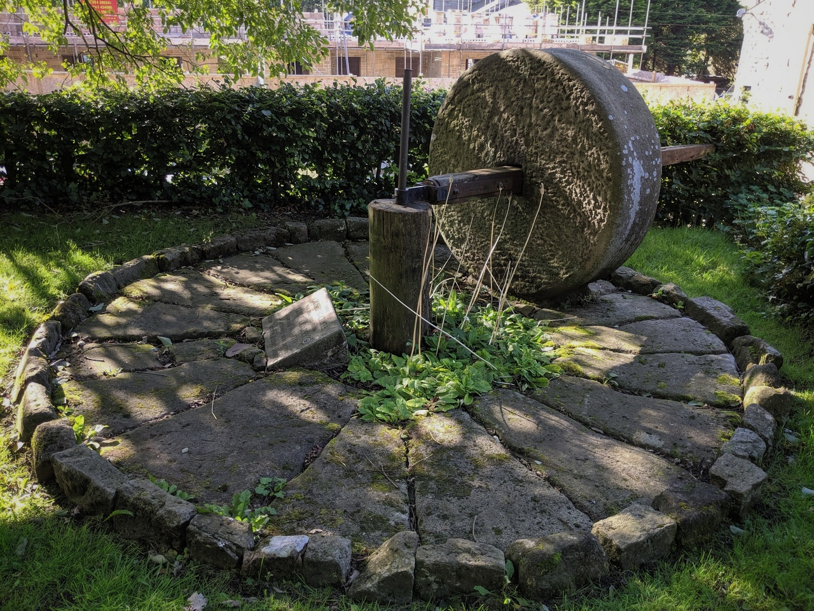
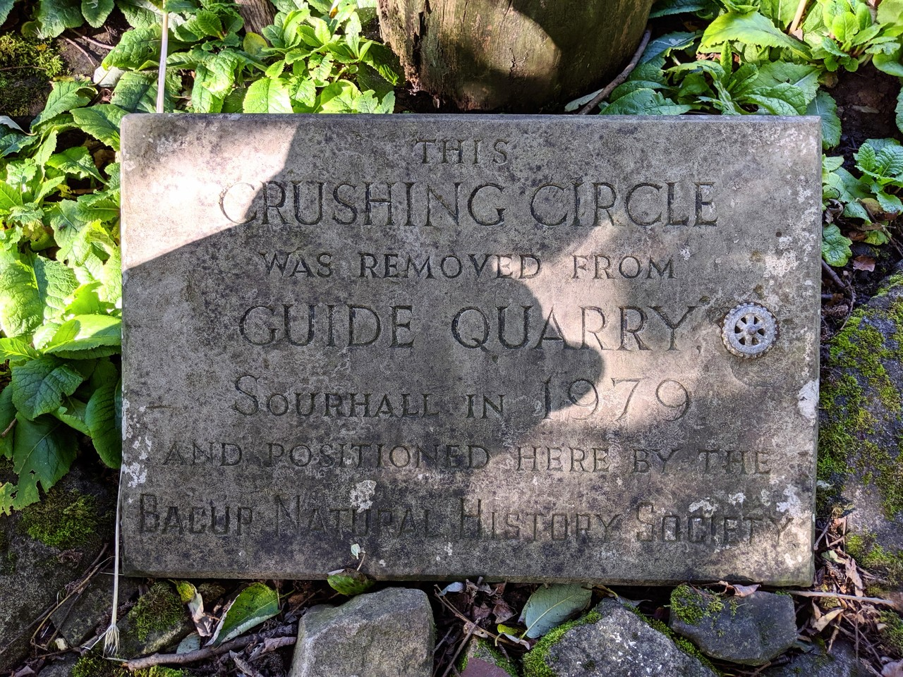

# Flower Scar Stone Crusher

## Todmorden, West Yorkshire

Geo URI: geo: 53.7219, -2.1358  
Latitude: 53° 43' 19" N  
Longitude: 2° 8' 9" W  

On the Flower Scar Road turnoff, Todmorden, where the tarmacked road becomes Tower Causeway there's an information sign about the 'Flow Scar stone crusher', a huge milling stone used to crush sandstone at Guide Quarry. The stone has been removed (purloined) and moved across the county border to Bacup Natural History Society.

Posted 20190827