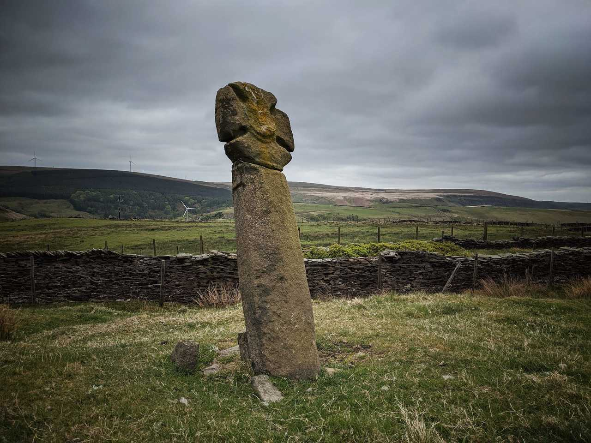

# Mount Cross

## Todmorden, West Yorkshire

Geo URI: geo: 53.7416, -2.1308
Latitude: 53° 44' 30" N
Longitude: 2° 7' 50" W

Mount Cross, also known as Idol Cross.

A farmer in 1976 said: "Queer things happened here long since. They worshipped idols here" (Lofthouse, Jessica, North Country Folklore, Hale: London 1976)

Posted 20200510