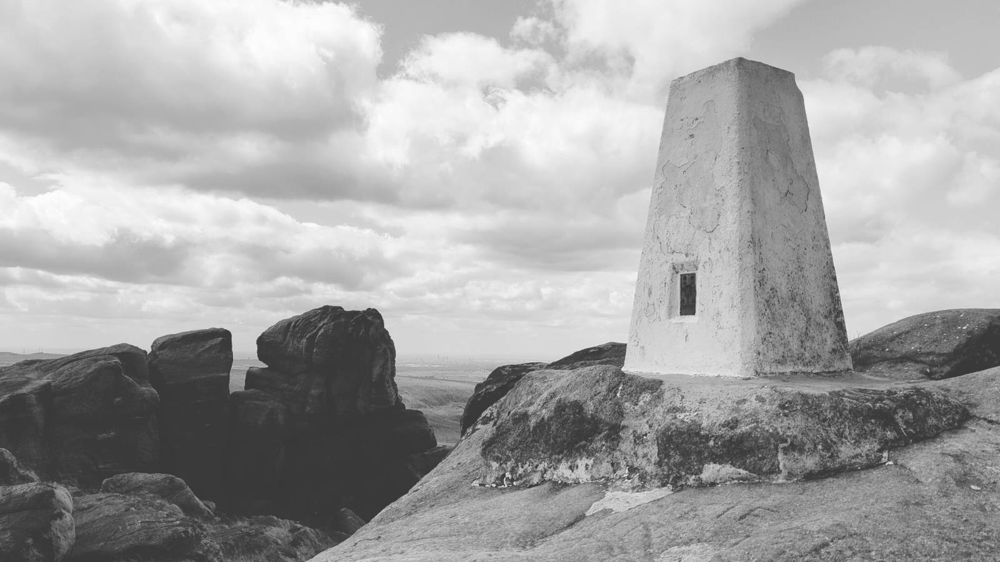
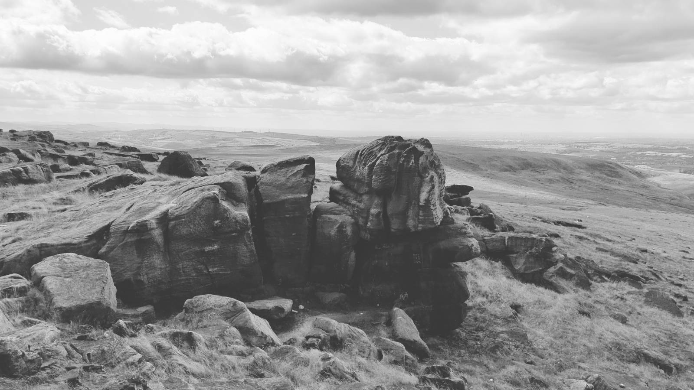
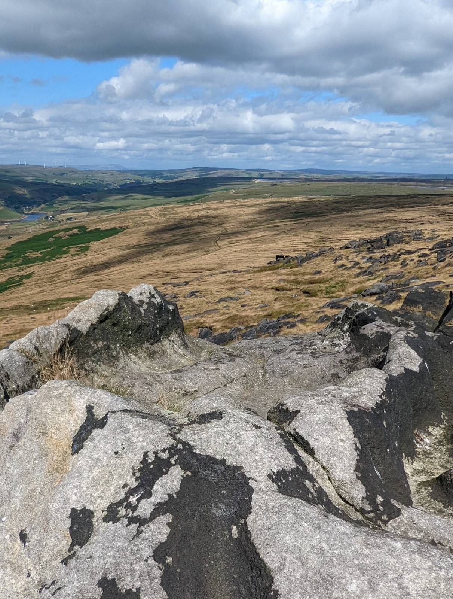

# Robin Hoods Bed

Situated right next to the Blackstone Edge trig point there's a large concave bowl in the top of one of the rocks named Robin Hood's Bed. Best climbed on a rare day when it's not windy.

Visited 20220803

* [Robin Hood’s Bed, Blackstone Edge](https://megalithix.wordpress.com/2011/03/25/robin-hoods-bed/)
* [Robin Hood's Bed, Blackstone Edge](https://www.geograph.org.uk/photo/5581059)

