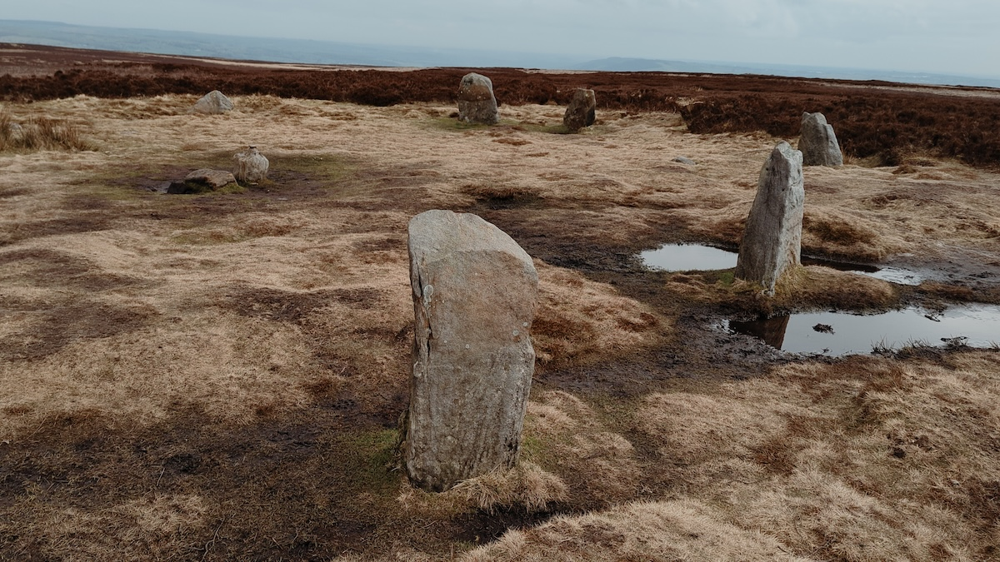
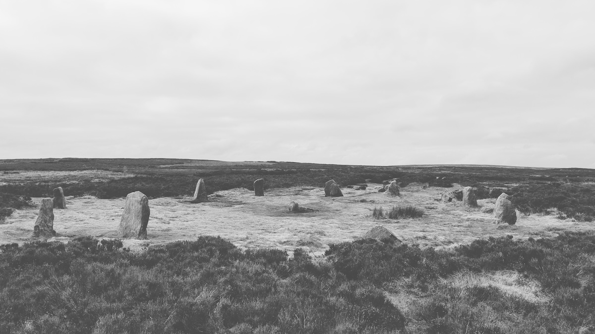
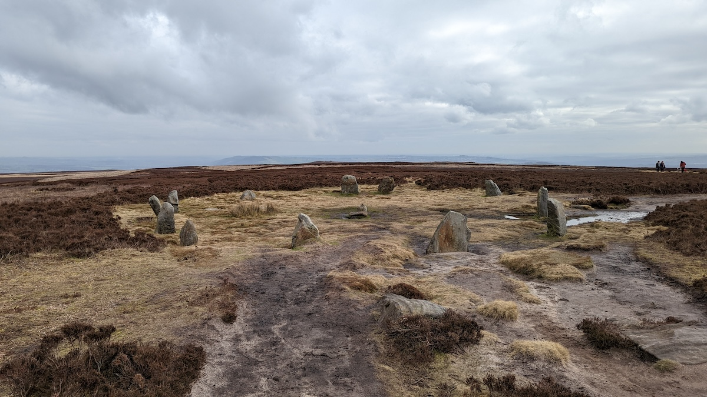
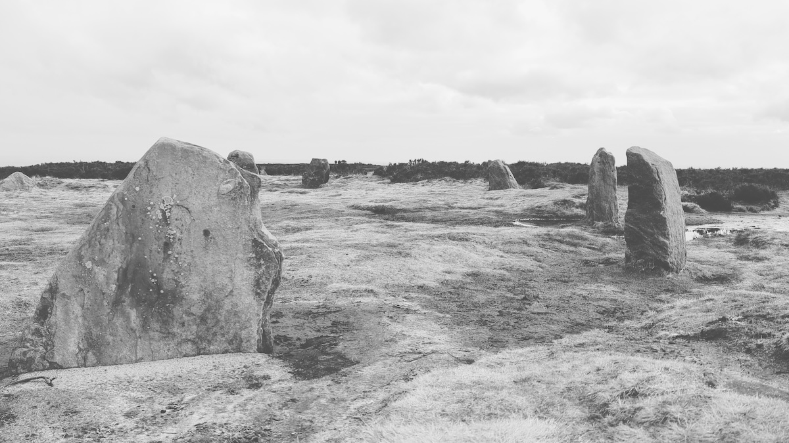

# Twelve Apostles

## Burley Moor, Ilkley

Date visited: 7th March 2022

### 53.901604° N, -1.809530° W

OS Grid Ref: SE 12612 45065  
Latitude: 53°54'6"N  
Longitude: 1°48'34"W  

## Links
* [stone-circles.org.uk](http://www.stone-circles.org.uk/stone/twelveapostles.htm)

