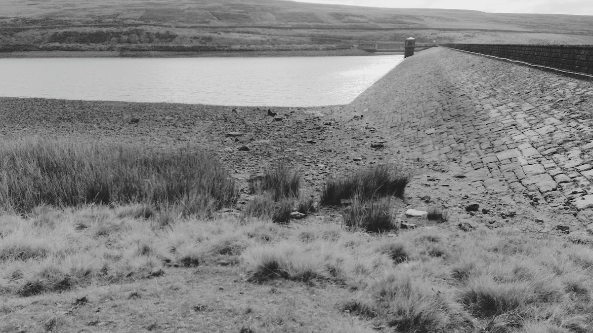
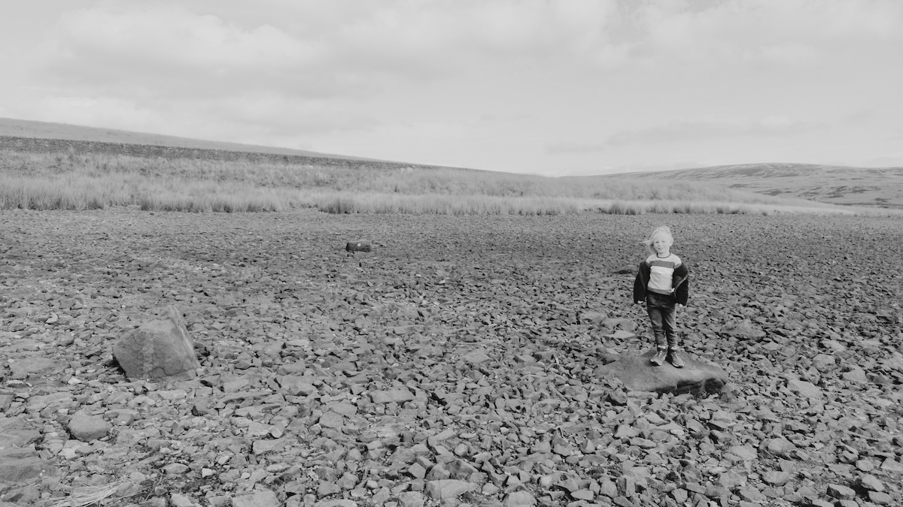
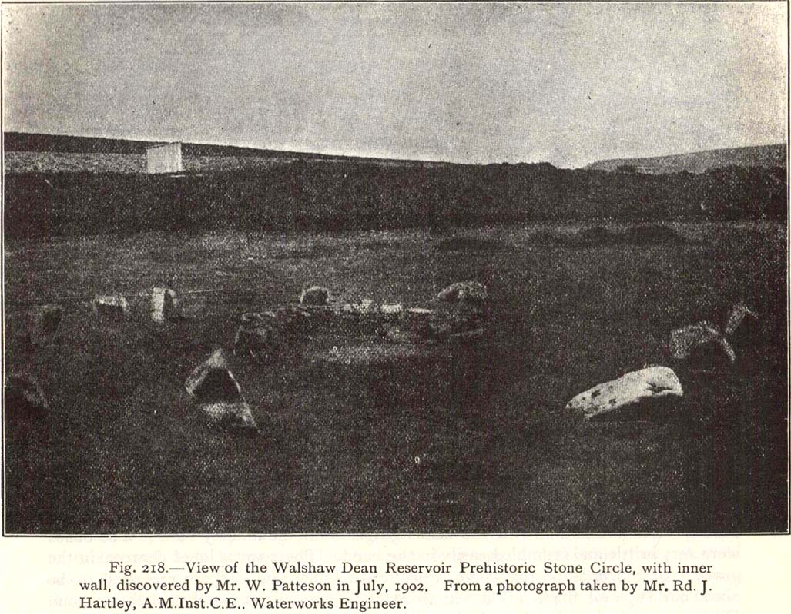
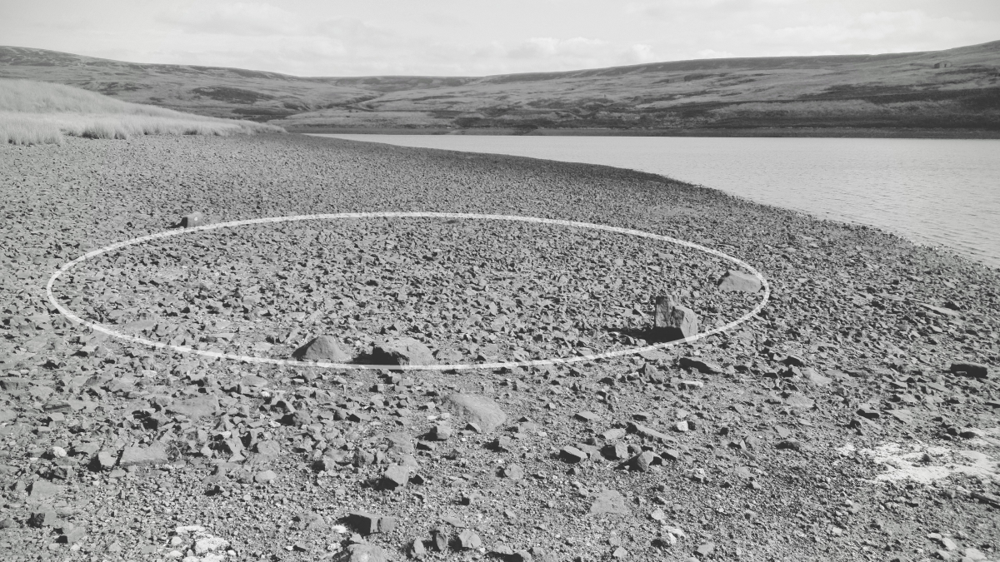
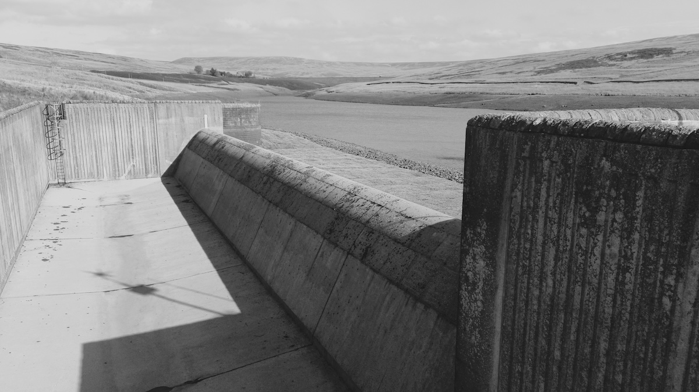

# Walshaw Dean Reservoir Circle

Date visited: 5th October 2024

A 'lost' circle thought to have been destroyed when the Victorians built the reservoirs, the engineers actually took the first photo of it in 1902 and it's always been just below the surface. 

Best visited in late summer for obvious reasons, you wont see it otherwise.

## 53.798474, -2.055182

OS Grid Ref: SD 96462 33575  
Latitude: 53°47'55"N  
Longitude: 2°3'19"W  

## Links
* [megalithic.co.uk](https://www.megalithic.co.uk/article.php?sid=1336)
* [[The Northern Antiquarian](https://megalithix.wordpress.com/ "The Northern Antiquarian")](https://megalithix.wordpress.com/2011/12/16/walshaw-dean/)

