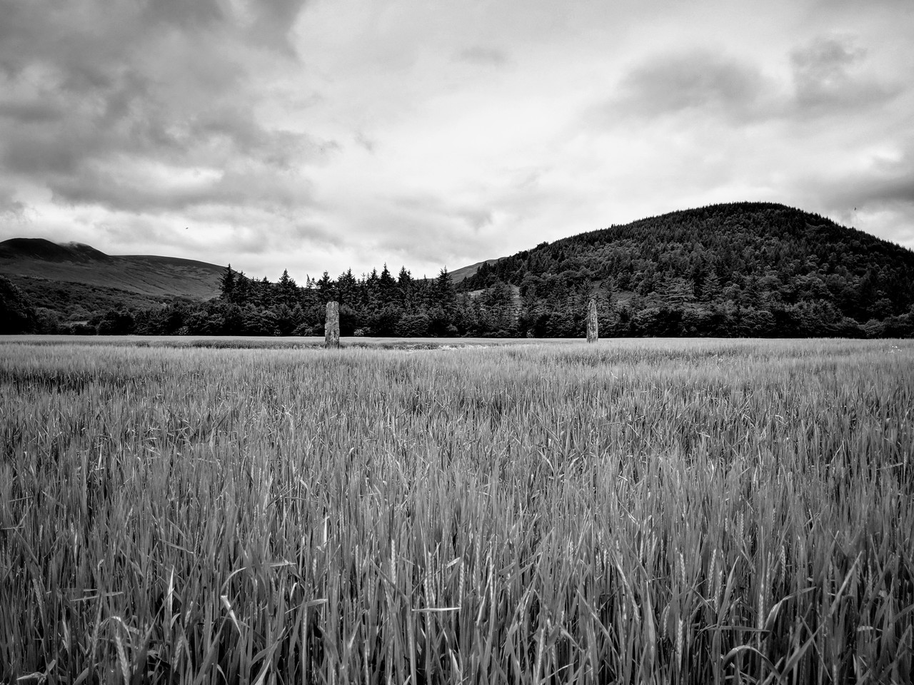
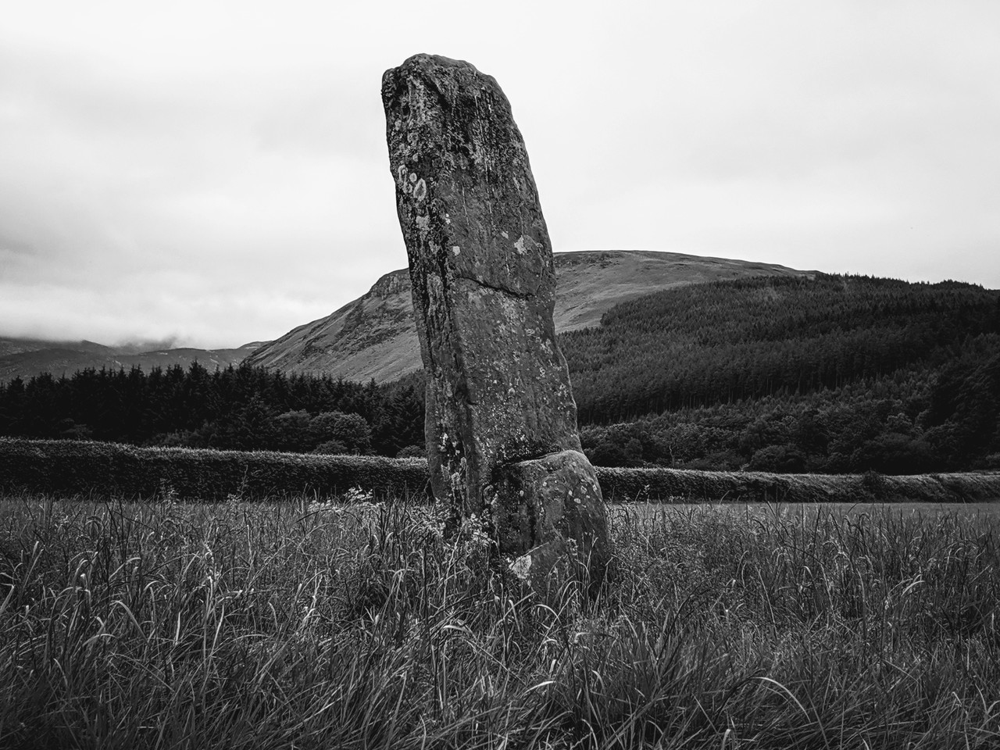

# Brodick Stones

Brodick 'Deer Park' Standing Stones, Cladach, Arran

Geo URI: geo:55.5896,-5.1647
Latitude: 55° 35' 22" N
Longitude: 5° 9' 53" W

Three standing stones separated by a road. The larger two were surrounded with barley crop so we couldn't get close.

Posted 20190624