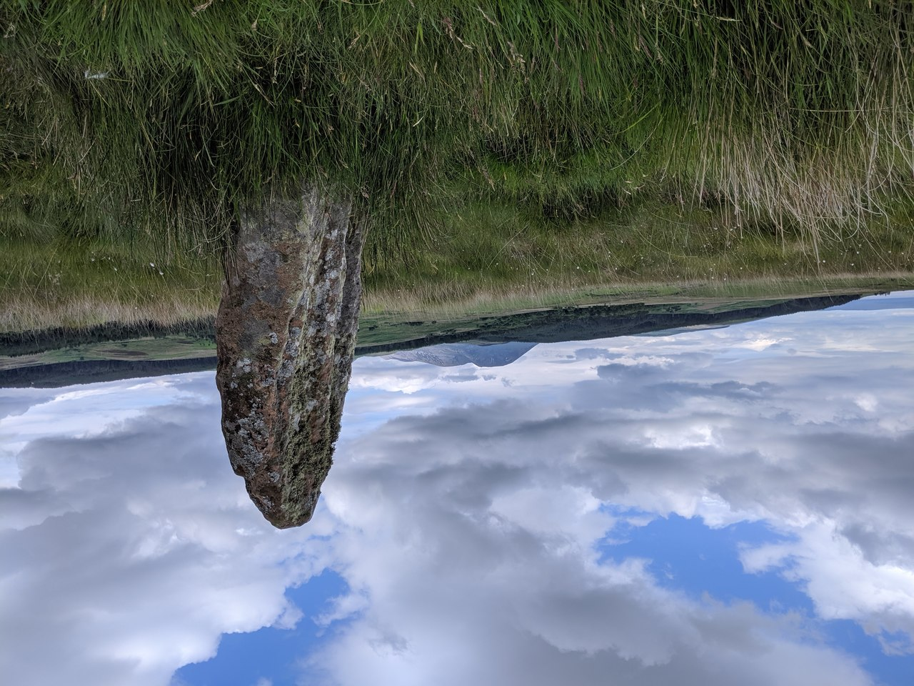

# Machrie Moor Stone 7

Geo URI: geo:55.5414,-5.3197
Latitude: 55° 32' 29" N
Longitude: 5° 19' 10" W

Part of the Machrie Moor complex, this poor stone was getting no attention from the other tourists on a beautiful warm June day, up a short way off the path with no signage it's easy to miss.

This stone and site turned out to be much more important than anyone knew at the time I visited: [Archaeologists search for 'enormous' ancient ritual site on Scottish island](https://www.scotsman.com/heritage-and-retro/heritage/archaeologists-search-for-enormous-ancient-ritual-site-on-scottish-island-3351332)

Posted 20190625