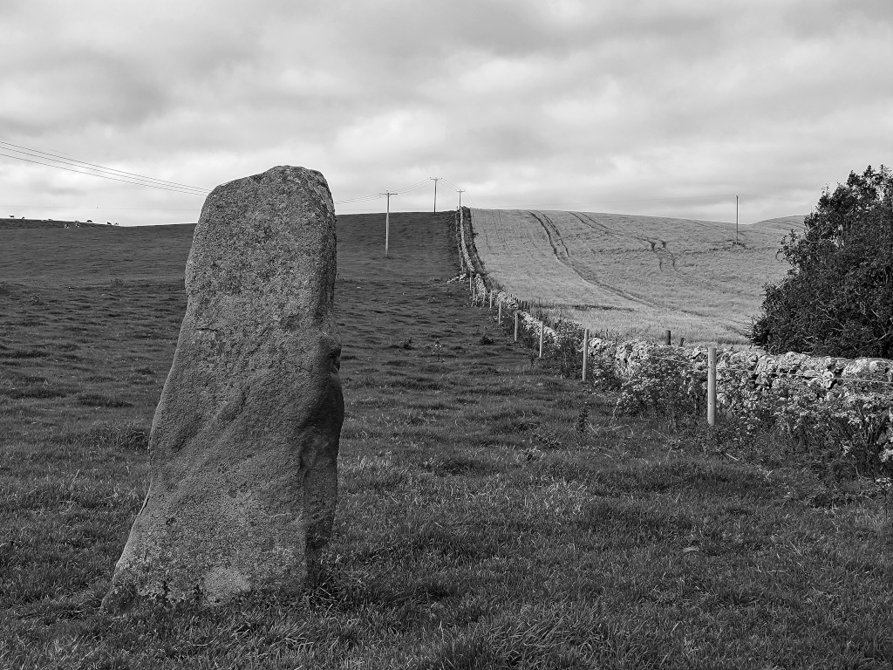

# Cairnweil Standing Stone

Close to the [Kirkmadrine Stones](kirkmadrine_stones.md) in a field by the road.

OS Grid Ref: NX 08630 48547  
Latitude: 54°47'43"N  
Longitude: 4°58'42"W  

Visited: 27082023

[Cairnweil standing stone](https://www.megalithic.co.uk/article.php?sid=6576)
