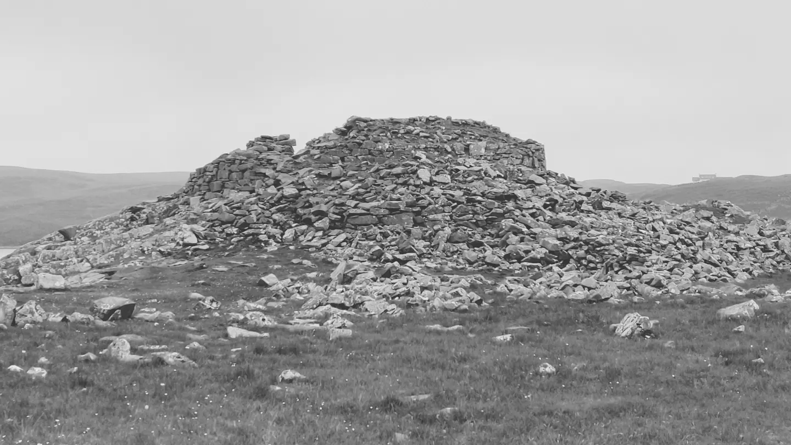
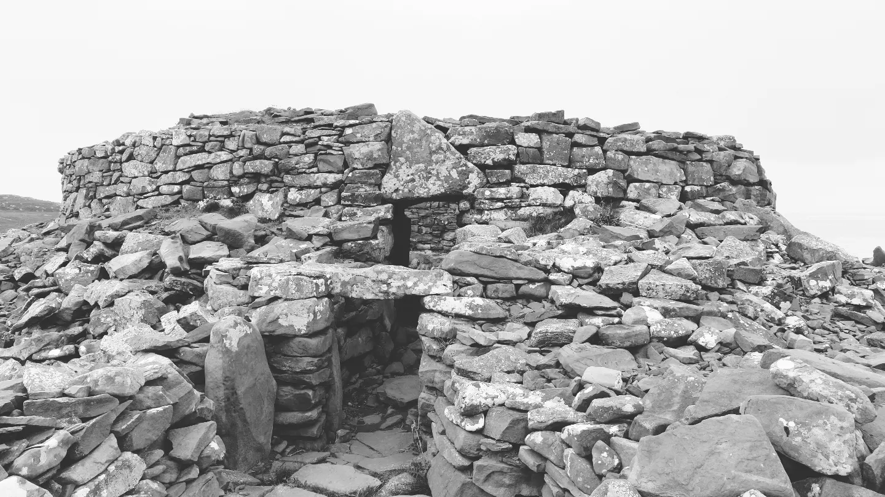
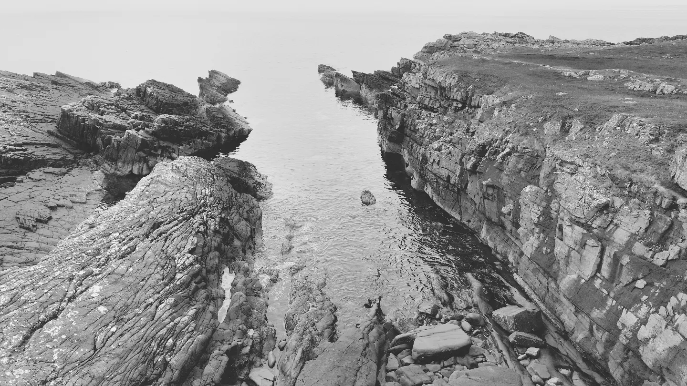
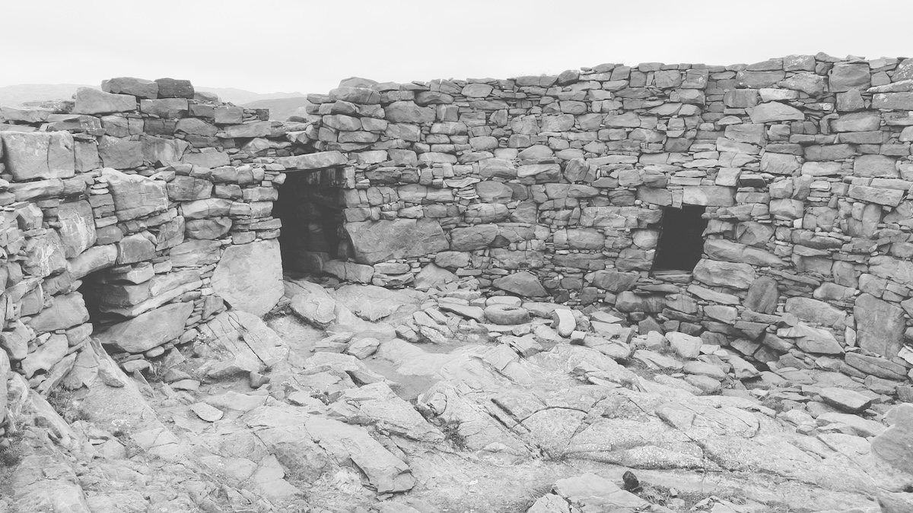
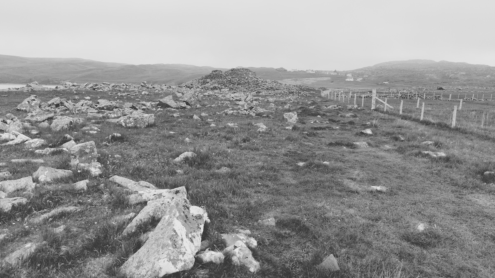

# Clachtoll Broch

Date visited: 29th May 2024

OS Grid Ref: NC 03659 27843  
Latitude: 58°11'44"N  
Longitude: 5°20'32"W  

## Links
* [clachtollbroch.com](https://www.clachtollbroch.com/)
* [canmore.org.uk](https://canmore.org.uk/site/4499/clachtoll)
* [megalithic.co.uk](https://www.megalithic.co.uk/article.php?sid=913669681)
