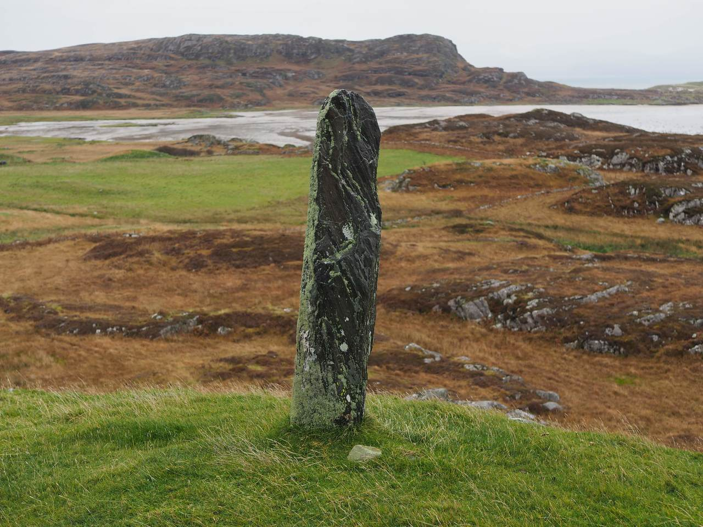
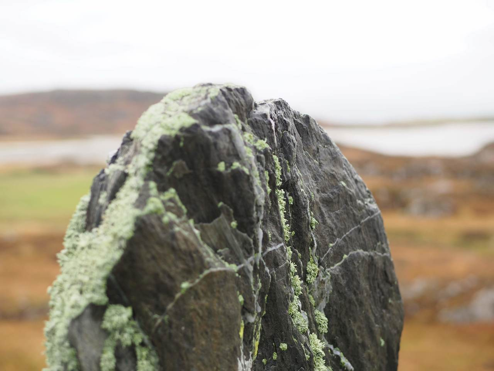
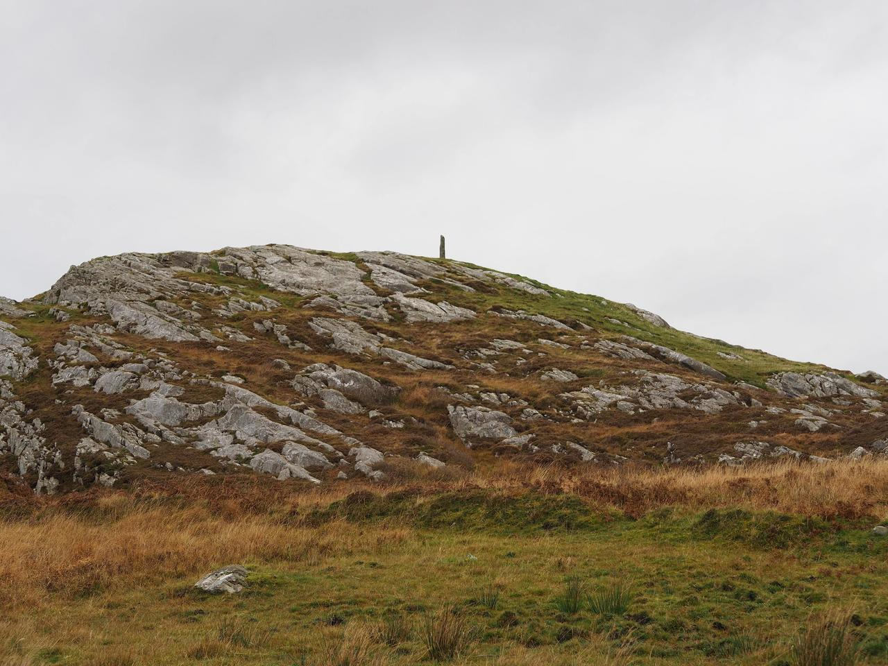

# Garvard

Geo URI: geo:56.0409,-6.2323  
Latitude: 56° 2' 27" N  
Longitude: 6° 13' 56" W  

A beautiful whinstone menhir, on a small hillock overlooking the south of the island. Apparently not the original location for the stone, it fell elswhere and was relocated here in the 1960s by the farmer, but it's a lovely spot with views of Oronsay and over the water to Jura.

