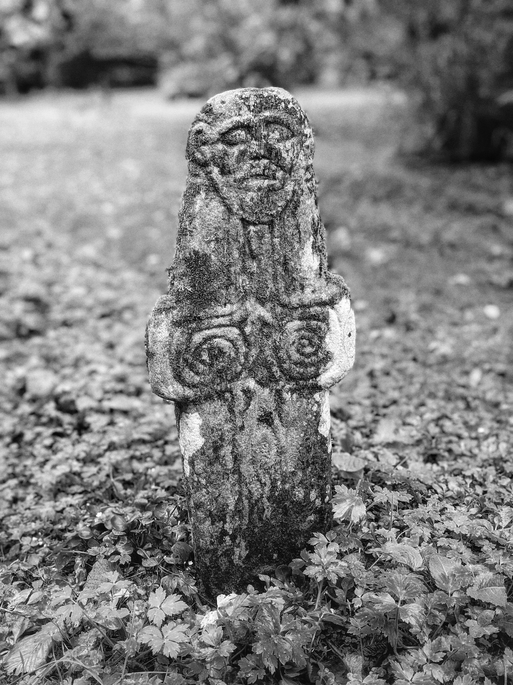

# Riasg Buidhe Cross

A 7th or 8th century stone cross that's been relocated to the ground of Colonsay House. [More on Wikipedia](https://en.wikipedia.org/wiki/Riasg_Buidhe_Cross)

Geo URI: geo:56.0929,-6.1884  
Latitude: 56° 5' 34" N  
Longitude: 6° 11' 18" W  

Visited 20200306
