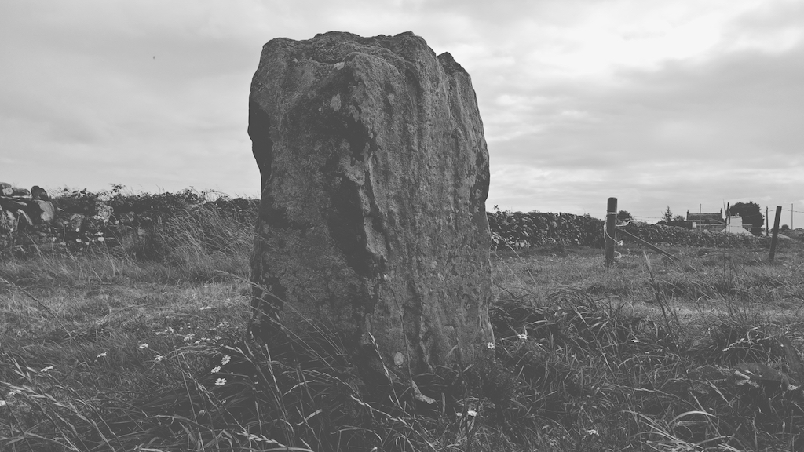
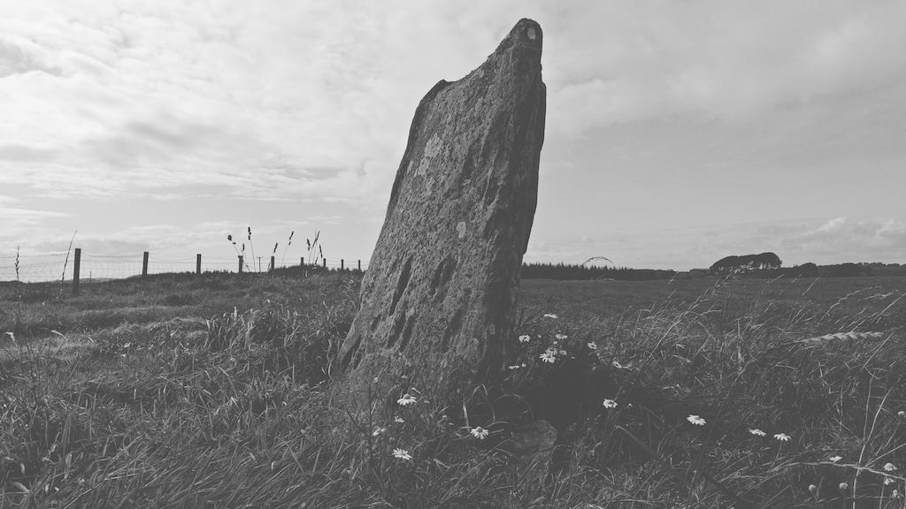

# Culgarie (Longcastle) Standing Stone

OS Grid Ref: NX 38257 48108  
Latitude:54°48'6"N  
Longitude:4°31'4"W  

Visited: 29082023

[Culgarie Standing Stone / Menhir](https://www.themodernantiquarian.com/site/4857/culgarie.html)

