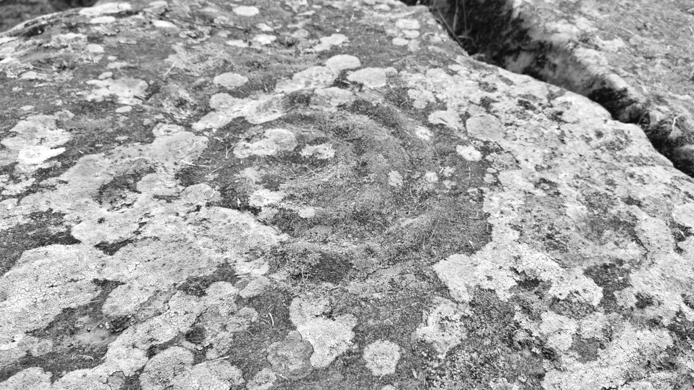
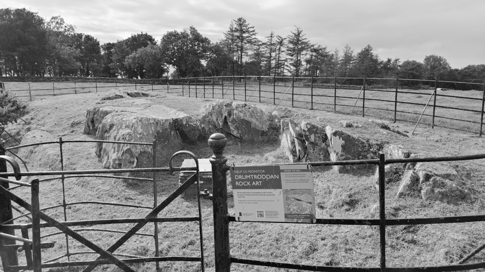

# Drumtroddan Rock Art

I visited this site at the wrong time of day with the sun high overhead so the marks were very faint. At sunrise or sunset the marks aren't as well defined as they used to be due to acid rain and even with ideal light I don't think the stones would be anything like the older photos on Megalithic:

[Drumtroddan Cup and Ring Markings](https://www.megalithic.co.uk/article.php?sid=1522)

OS Grid Ref: NX 36277 44708  
Latitude: 54°46'14"N  
Longitude: 4°32'48"W  

Visited: 29082023

[Drumtroddan Cup and Ring Marked Rocks](https://www.historicenvironment.scot/visit-a-place/places/drumtroddan-cup-and-ring-marked-rocks/)