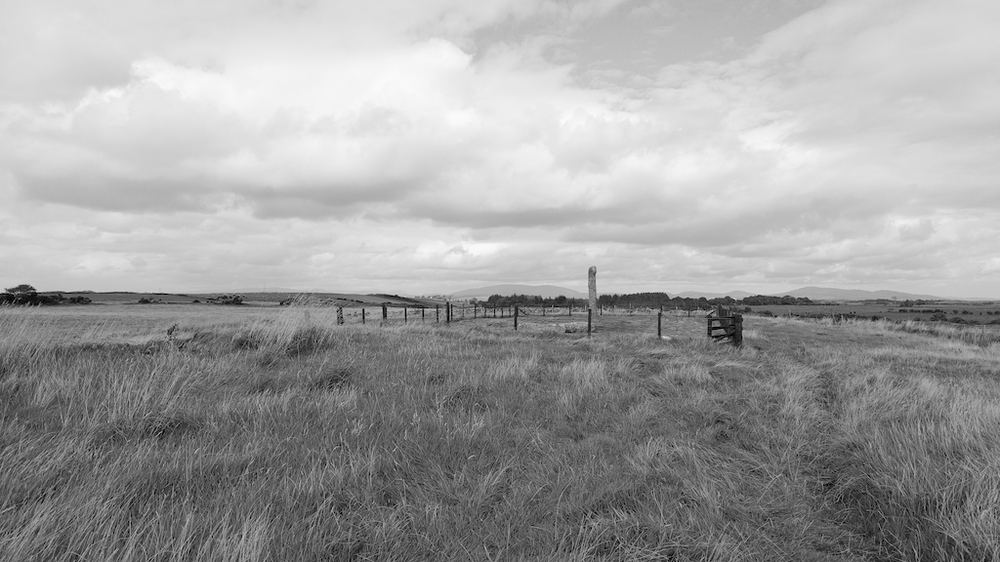
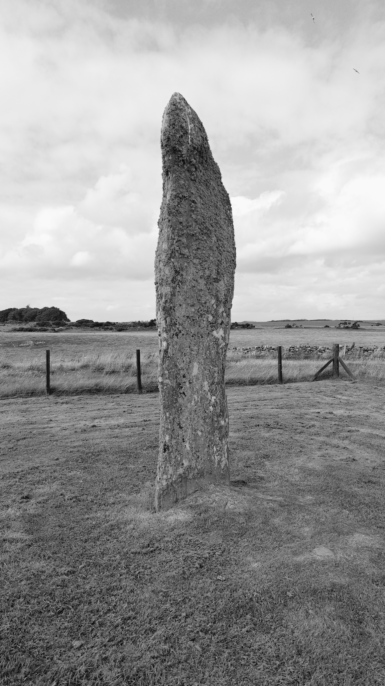
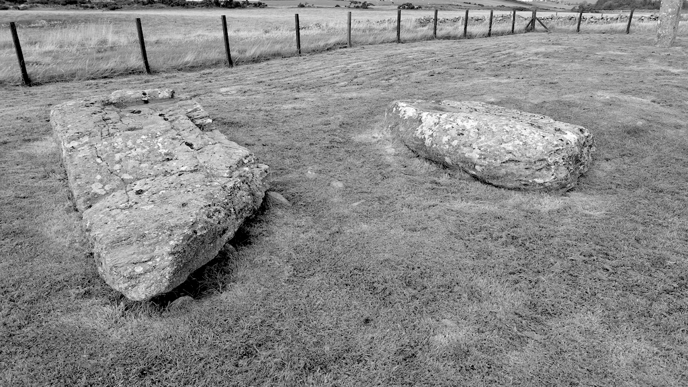

# Drumtroddan Standing Stones

OS Grid Ref:NX 36454 44296  
Latitude:54°46'1"N  
Longitude:4°32'37"W  

Visited 29082023

[Drumtroddan Standing Stones](https://www.historicenvironment.scot/visit-a-place/places/drumtroddan-standing-stones/)
