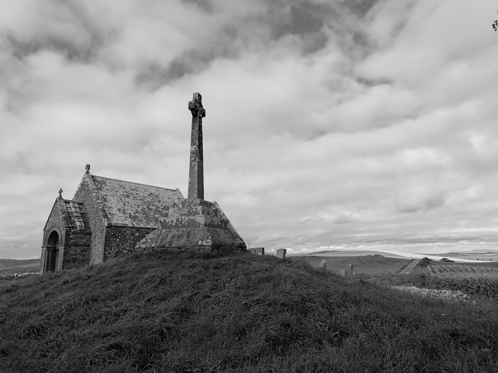
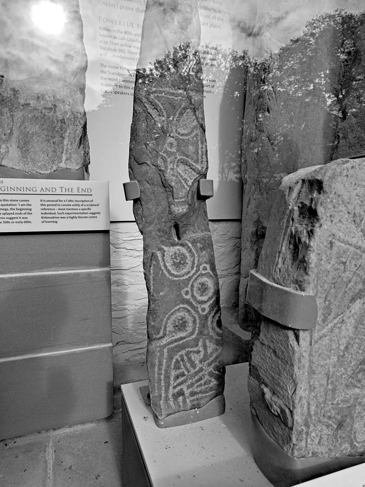
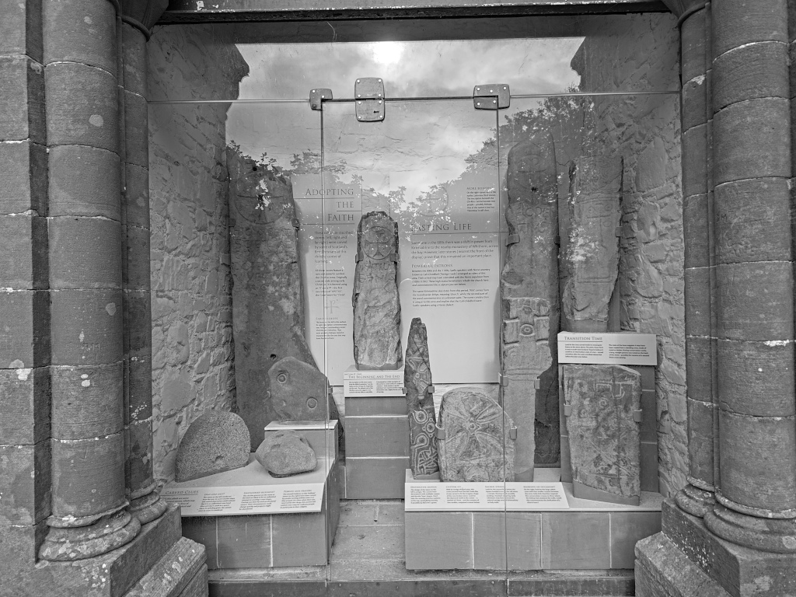

# Kirkmadrine Stones

Early Christian collection of stones, but with some earlier local motifs. 

OS Grid Ref: NX 08008 48402  
Latitude: 54°47'37"N  
Longitude: 4°59'17"W  

Visited: 28082023

[Kirkmadrine Stones](https://www.historicenvironment.scot/visit-a-place/places/kirkmadrine-stones/)
