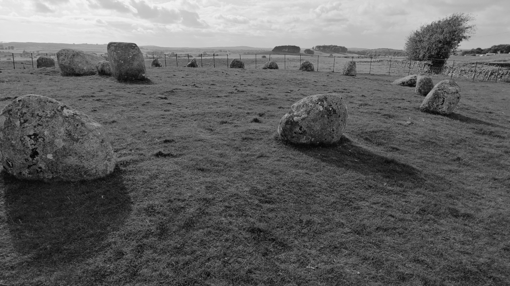

# Torhouse Stone Circle

OS Grid Ref: NX 38272 56442  
Latitude: 54°52'35"N  
Longitude: 4°31'20"W  

Visited: 29082023

[Torhouse Stone Circle](https://www.historicenvironment.scot/visit-a-place/places/torhouse-stone-circle/)
