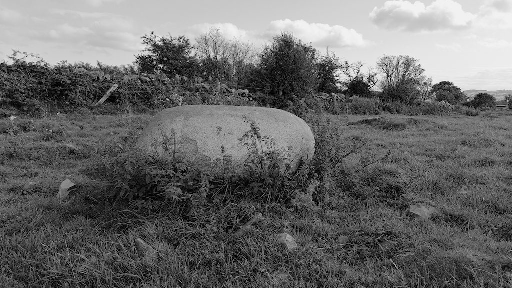
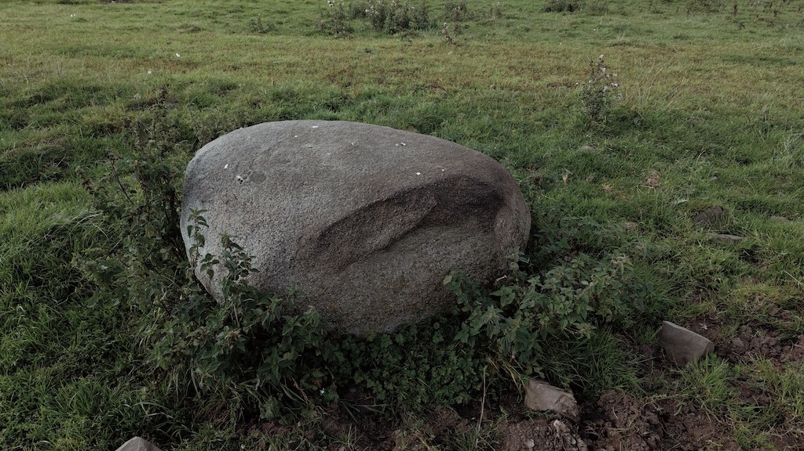

# Torhouse Unnamed Stone

Close to the Torhouse Circle in a field down the driveway to a residential property called Cunninghame, listed on the Ordnance Survey map as a Standing Stone but looks to be more likely a glacial erratic. 

OS Grid Ref: NX 38439 56092  
Latitude:54°52'24"N  
Longitude:4°31'10"W  

Visited 29082023

