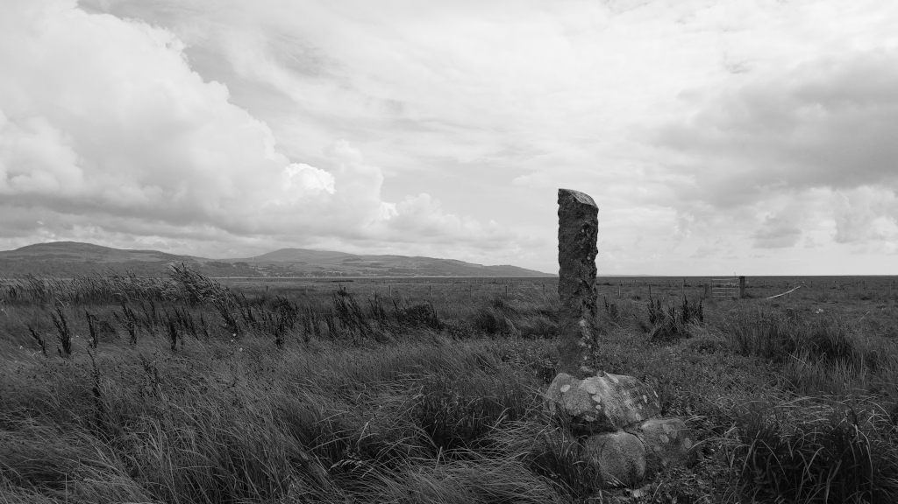
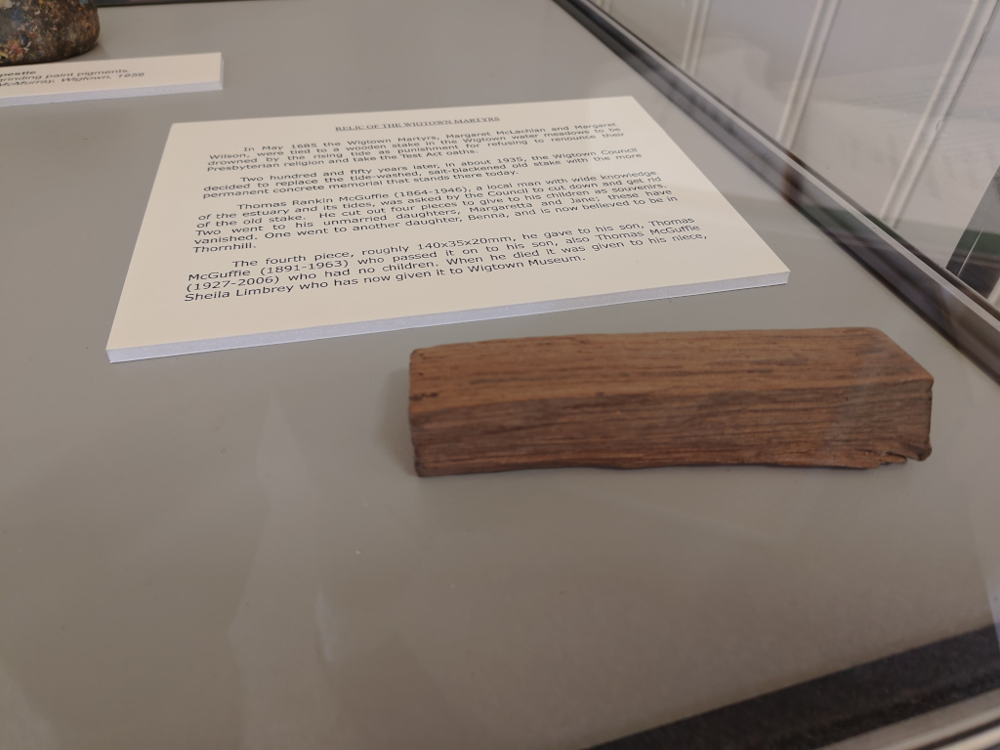

# Wigtown Martyr's Stake

OS Grid Ref: NX 43940 55673  
Latitude: 54°52'17"N  
Longitude:4°26'1"W  

Visited: 31082023

A relic in the Wigtown library:

Martyr's graves in the nearby churchyard:

[Wigtown Martyrs](https://en.wikipedia.org/wiki/Wigtown_Martyrs)