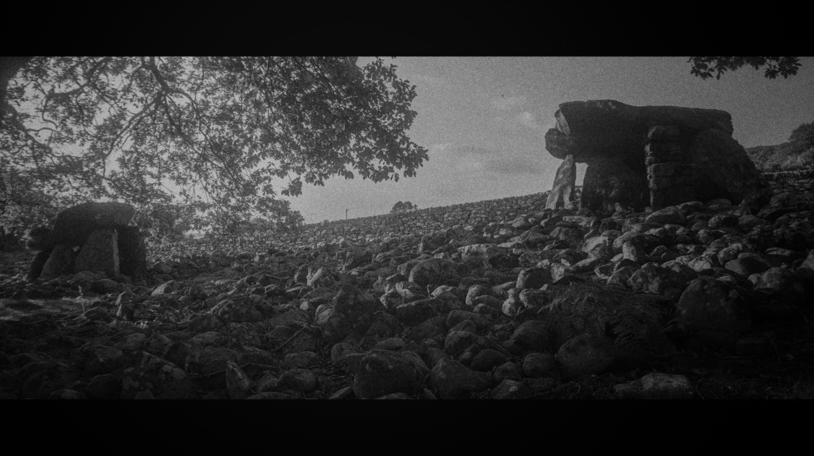

# Dyffryn Ardudwy

Geo URI: geo:52.7847,-4.0948  
Latitude: 52° 47' 4 " N  
Longitude: 4° 5' 41" W  

Erected 3000BC to 1900BC originally these two chambers would have been covered in stone as a single monument. It must have been an irresistible source of easy material for farmers building dry stone walls and now the inner chambers and base are all that's left.

Posted 20210903