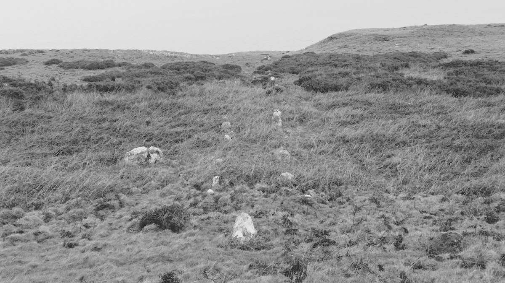
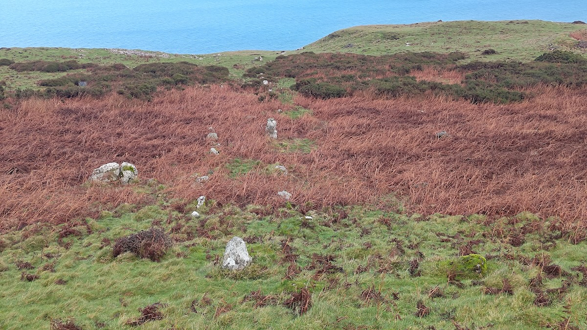
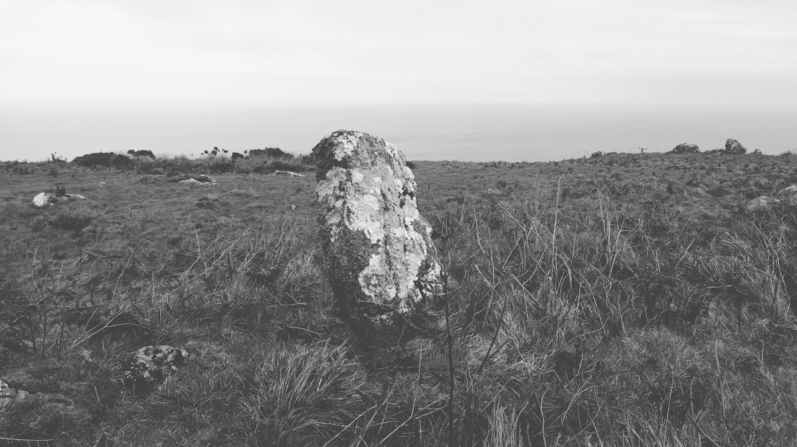
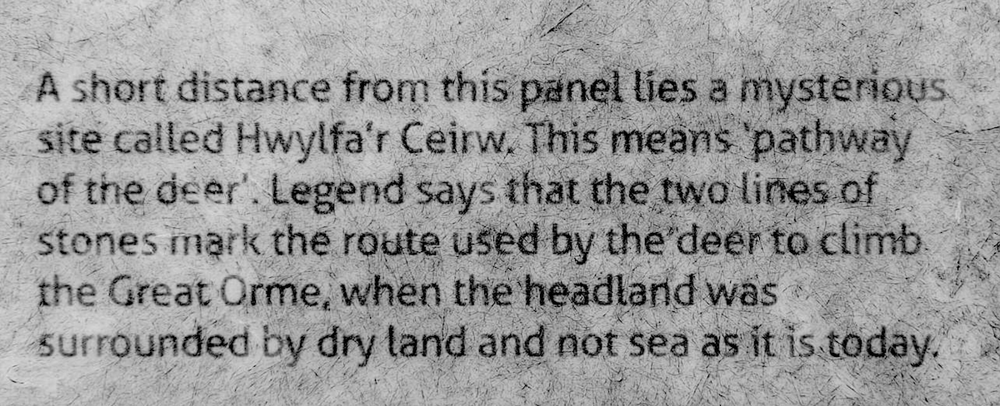

# Hwylfa’r Ceirw stone row

Date visited: 18th February 2024

Also known as the Path of the Deer. Extremely difficult to find due to the Ordnance Survey map being massively incorrect.

53.3386988,-3.8572887  
Location is approximate, good luck.

Look for this stone higher up, then walk towards the sea and you should find the row

## Links
* [megalithic.co.uk](https://www.megalithic.co.uk/article.php?sid=11133)