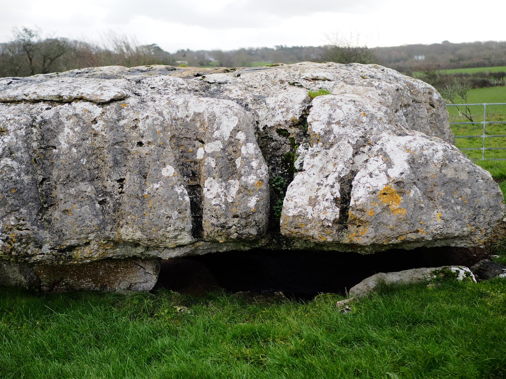
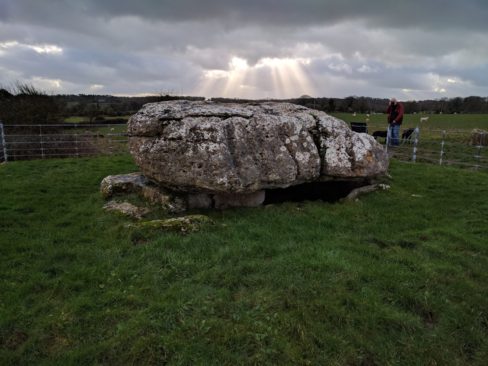

# Lligwy Cromlech

## Anglesey/Ynys Mon

Geo URI: geo:53.3501,-4.2528  
Latitude: 53° 21' 0" N  
Longitude: 4° 15' 10" W  

Cromlech is Welsh for a megalithic tomb consisting of a large flat stone laid on upright ones; a dolmen ([Wikipedia](https://en.wikipedia.org/wiki/Lligwy_Burial_Chamber))

